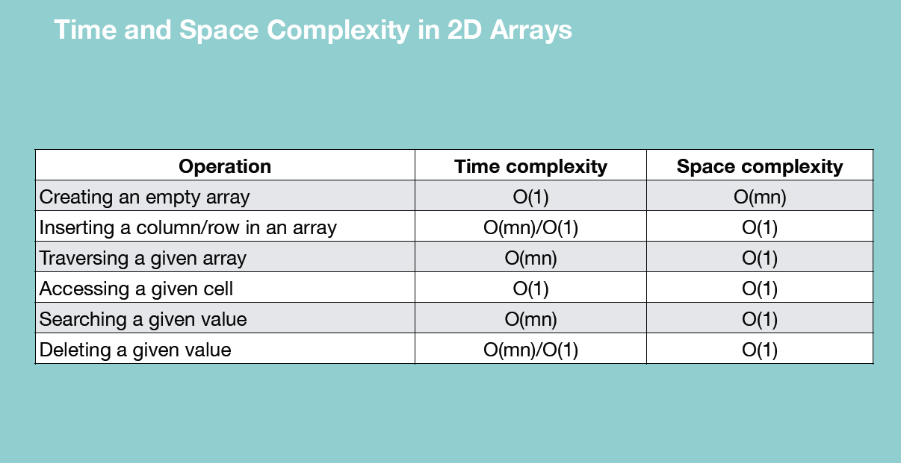

## Arrays:

### One Dimensional+++++++++++++++++++++++++

1. Not native DS in python
2. The array created using numpy and array module is more memory efficient than the in-built list DS
3. Array can store element of specified datatype.

    In array initialization we write: **myArray=array.array('i',[12,3,4,5,3])**
    
    Here i is tells us about array type. Following can be the array type

   

4. Element of array are located in contiguous blocks in the memory
5. 2 types of array: One Dimensional and Multi-Dimensional
6. a[i][j]: i is row index and j is column index
7. a[i][j][k]: i is depth, j is row and k is column
8. For 1D array: In memory, compiler allocates 6 contifguous block in RAM for a 6 element rows. These cells are contiguous.
9. For 2D array: In memory, 2D array is represented as 1D array. Rows stacked one after another. Row1 + row2 +row3. 
10. For 3D array: In memory, 3D array is stored as 1D array. Rows of a particular depth are stacked one after another and then rows of next depth.....
11. Array module is in Python standard library. No installation is required. Array module creates only homogeneous arrays.
12. np arrays are more feature rich and high performance arrays than the arrays created using Array module.
13. numpy is not a part of python standard library.
14. Creating an empty arrays through both Array or Numpy module requires O(1) time and space complexity. 
15. Creating an array with elements in it, its time and space complexity is O(n). In time complexity, you copy and paste elements from your list iterable into your newly created array.
16. Array Insertion: Array created with Array module: my_array.insert(index,element_value)
17. Array Insertion: Time Complexity: O(N) | Space Complexity: O(1) coz we need only 1 place for the new element
18. Array Traversal/Traversing the array: <br>
       - Time complexity = O(N)              since we have to traverse the entire array
       - Space complexity = O(1)             since we don't need an extra location to perform this operation
19. Access any given cell in an array: `myArray[1]`
20. Complexity of Accessing the element of an array
    - Time complexity: O(1)               
    - Space complexity: O(1)                  since we don't need extra space here to perform this operation
21. Complexity of searching an element in an array:
    - Time complexity = O(n)
    - Space complexity = O(1)             you don't need to store anything specific for this operation
    range() basically generates a sequence of number it basically provides numbers on demand for each loop
22. len() function also has O(1) time complexity as it simply retrieves the stored metadata value
23. When you delete an element from an array, you can't leave the element empty and keep it's index.It will make the array non-contiguous.
     On deletion from a particular index you need to move right side element by one step to left.
24. Deletion is most efficient on deletion of last element and most time consuming on deletion of first element.
25. Array Deletion: arr.remove(value)
26. Array Deletion: TC= O(N) SC= O(1)  {O(N) TC is because if you have to remove 1st element then you have to move all next elements to the left}
27. You can append an element at the end of your array using `myArray.append()` function. **It is an mutable operation on the array**. The space and time complexity of this is O(1)
28. **.append() Vs .extend()**: append is used to append an element. extend is used to concat a new array into our existing array. Both of these are mutable operation.
29. **fromlist()** method is an array method that is used to add items from list into the end of an array. myArray.fromList([1,2,34]). Again a **mutable** operation.
30. **.remove():** removes the first occurence of the element in an array.
31. **myArray.reverse():** reverses the array. It is **mutable** function.
32.  **myArray.count(element)**: Return the number of occurences of element in the array.
33. To convert your array into list: **myArray.tolist()**

### Two Dimensional+++++++++++++++++++++++++
1.  For matrix purposes we use 2-D arrays. Like when you are dealing with a problem that includes some kind of game layout.
2.  To initialize a 2-D array, we use numpy module to create 2-D arrays.<br><i>
        import numpy as np
<br>    twoDArray=np.array([ [11,15,6],[10,14,5],[15,18,14,9] ])
<br>        print(twoDArray)
</i>
3.  Time & Space Complexity of initialization is O(mn) [m:columns | n: rows]
4.  Two ways of inserting values in 2-D arrays: Adding column and adding rows
5.  **Adding a column**: TC is O(mn) Shifting a column comprising of n rows to the right till you reach the mth column
<br>       ` newTwoDArray=np.insert(existing2DArray,index of insertion(starts with 0),[1,2,3,4],axis=1)`  [1: column and 0: row]
6. **Adding a row**: TC is O(mn) Shifting a rows comprising of m column one step down till you reach the nth row 
<br>        `newTwoDArray=np.insert(existing2DArray,index of insertion(starts with 0),[1,2,3,4],axis=0)`  [1: column and 0: row]
7.  The insertion in a 2-D array is **not a mutable operation**. You will have to store the result in some other variable
8.  **np.append(array_name,to_be_added_2Darray,axis=0 or 1)**. Append will simply add it post the last row/column
9. **len(twoDArray)**: Give the number of rows in a 2D array
10. **len(twoDArray[0])**: Gives the number of columns in a 2D array
11.  **Accessing elemetns of 2D array**: array[rowIndex][colIndex] . TC: O(1) | SC: O(1)
12. **Traversing element of 2D array**: 
    ```python
                def traverseTDArray(array):
                    for i in range(len(array)):
                        for j in range(len(array[0])):
                            print(array[i][j])
    ```
        TC: O(nm)   |   SC: O(1)
13. **Searching in a 2D array**: In linear search we do a nested loop search of rows and columns and checks each element. We see if this is the element we are looking for. The search goes through a row and then moves to the row below it.          TC: O(mn)    | SC(1)
14. **Deleting from 2D array**: During deletion numpy creates another 2-D array but without the row/column that you want to delete. This results in a space complexity of O(mn) since all of remaining matrix has to be copied at a new location.
                             np.delete(twoDArray,index,axis=1)           TC: O(nm) : SC(mn)
15. **np.delete** is a **immutable** operation
16. Because **Insertion and Deletion** operation in a 2D array is an immutable operation, and because in both the operations we have to paste the elements of existing array into a new memory location **so the space complexity of both operations is O(MN)**
17. Time complexity and Space complexity of 2D array operations: 
<br>

    