## DSA for data engineers:
1. Check the bookmarks on chrome in dsa folder 
2. Leetcode medium
3. In Linked List, Single linked list is very important
4. In Tree, BST is very important
5. Graph is the least priority. Never comes in data engineering interviews
6. In Algorithms, Searching is very important. Liner and Binary search is very important.
7. In Algo, Sorting is very important. Hashing is also very important.

    Please check out this [Dashboard](https://whimsical.com/dsa-for-data-engineers-W9dF8SC72c4dfAuCwL5jFV) that summarizes all the requirements


## Big O

1. Omega is best, theta is avg, and omicron is worst case
2. We always look at worst case. There is only worst case big o. 
3. Drop the constants. So, `O(2n)` is actually `O(n)`
4. Drop non-dominant terms. So, `O(n^2 + n)` is actually `O(n^2)`
5. Wherever the number of elements in your array get halved during search then it will take **`"log of n to the base 2" aka LogN`** steps to search our target element
6. Order: **`O(1) << O(log N) << O(N) << O(Nlog(N)) << O(N^2)`**
7. Space complexity states how much memory in the worst case is needed at any point in the algorithm.
8. Recursive algos consume high memory as we have to remember numbers in each recursive iteration.
9. Add vs multiply for time complexities. If you have two input parameters like a,b. Then you can have O(a+b) or O(a*b) as the time complexities.


## Arrays:

### One Dimensional+++++++++++++++++++++++++

1. Not native DS in python
2. The array created using numpy and array module is more memory efficient than the in-built list DS
3. Array can store element of specified datatype.

    In array initialization we write: **myArray=array.array('i',[1,2,3,4,5,3])**
    
    Here i is tells us about array type. Following can be the array type

   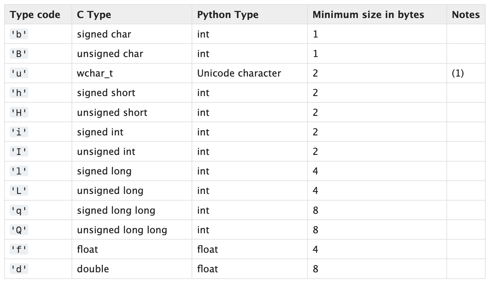

4. Element of array are located in contiguous blocks in the memory
5. 2 types of array: One Dimensional and Multi-Dimensional
6. a[i][j]: i is row index and j is column index
7. a[i][j][k]: i is depth, j is row and k is column
8. For 1D array: In memory, compiler allocates 6 contifguous block in RAM for a 6 element rows. These cells are contiguous.
9. For 2D array: In memory, 2D array is represented as 1D array. Rows stacked one after another. Row1 + row2 +row3. 
10. For 3D array: In memory, 3D array is stored as 1D array. Rows of a particular depth are stacked one after another and then rows of next depth.....
11. Array module is in Python standard library. No installation is required. Array module creates only homogeneous arrays.
12. np arrays are more feature rich and high performance arrays than the arrays created using Array module.
13. numpy is not a part of python standard library.
14. Creating an empty arrays through both Array or Numpy module requires O(1) time and space complexity. 
15. Creating an array with elements in it, its time and space complexity is O(n). In time complexity, you copy and paste elements from your list iterable into your newly created array.
16. Array Insertion: Array created with Array module: my_array.insert(index,element_value)
17. Array Insertion: Time Complexity: O(N) | Space Complexity: O(1) coz we need only 1 place for the new element
18. Array Traversal/Traversing the array: <br>
       - Time complexity = O(N)              since we have to traverse the entire array
       - Space complexity = O(1)             since we don't need an extra location to perform this operation
19. Access any given cell in an array: `myArray[1]`
20. Complexity of Accessing the element of an array
    - Time complexity: O(1)               
    - Space complexity: O(1)                  since we don't need extra space here to perform this operation
21. Complexity of searching an element in an array:
    - Time complexity = O(n)
    - Space complexity = O(1)             you don't need to store anything specific for this operation
    range() basically generates a sequence of number it basically provides numbers on demand for each loop
22. len() function also has O(1) time complexity as it simply retrieves the stored metadata value
23. When you delete an element from an array, you can't leave the element empty and keep it's index.It will make the array non-contiguous.
     On deletion from a particular index you need to move right side element by one step to left.
24. Deletion is most efficient on deletion of last element and most time consuming on deletion of first element.
25. Array Deletion: arr.remove(value)
26. Array Deletion: TC= O(N) SC= O(1)  {O(N) TC is because if you have to remove 1st element then you have to move all next elements to the left}
27. You can append an element at the end of your array using `myArray.append()` function. **It is an mutable operation on the array**. The space and time complexity of this is O(1)
28. **.append() Vs .extend()**: append is used to append an element. extend is used to concat a new array into our existing array. Both of these are mutable operation.
29. **fromlist()** method is an array method that is used to add items from list into the end of an array. myArray.fromList([1,2,34]). Again a **mutable** operation.
30. **.remove():** removes the first occurence of the element in an array.
31. **myArray.reverse():** reverses the array. It is **mutable** function.
32.  **myArray.count(element)**: Return the number of occurences of element in the array.
33. To convert your array into list: **myArray.tolist()**

### Two Dimensional+++++++++++++++++++++++++
1.  For matrix purposes we use 2-D arrays. Like when you are dealing with a problem that includes some kind of game layout.
2.  To initialize a 2-D array, we use numpy module to create 2-D arrays.<br><i>
        import numpy as np
<br>    twoDArray=np.array([ [11,15,6],[10,14,5],[15,18,14,9] ])
<br>        print(twoDArray)
</i>
3.  Time & Space Complexity of initialization is O(mn)  [m:columns | n: rows]

4.  Two ways of inserting values in 2-D arrays: Adding column and adding rows
5.  **Adding a column**: TC is O(mn) Shifting a column comprising of n rows to the right till you reach the mth column

    ```python
        newTwoDArray = np.insert(existing2DArray,index of insertion(starts with 0),[[1,2,3,4]],axis=1) # [1: column and 0: row]
    ```
6. **Adding a row**: TC is O(mn) Shifting a rows comprising of m column one step down till you reach the nth row 
    ```python       
    newTwoDArray=np.insert(existing2DArray,index of insertion(starts with 0),[[1,2,3,4]],axis=0) #  [1: column and 0: row]
    ```
7.  The insertion in a 2-D array is not a mutable operation. You will have to store the result in some other variable

8.  **np.append(array_name,to_be_added_2Darray,axis=0 or 1)**. Append will simply add it post the last row/column

9. **len(twoDArray)**: Give the number of rows in a 2D array

10. **len(twoDArray[0])**: Gives the number of columns in a 2D array

11.  **Accessing elements of 2D array**: 
`array[rowIndex][colIndex] #TC: O(1) | SC: O(1)`

12. **Traversing element of 2D array**: 
    ```python
                def traverseTDArray(array):
                    for i in range(len(array)):
                        for j in range(len(array[0])):
                            print(array[i][j])

        #TC: O(nm)   |   SC: O(1)
    ```
13. **Searching in a 2D array**: In linear search we do a nested loop search of rows and columns and checks each element. We see if this is the element we are looking for. The search goes through a row and then moves to the row below it.          TC: O(mn)    | SC(1)
14. **Deleting from 2D array**: During deletion numpy creates another 2-D array but without the row/column that you want to delete. This results in a space complexity of O(mn) since all of remaining matrix has to be copied at a new location.
                             np.delete(twoDArray,index,axis=1)           TC: O(nm) : SC(mn)
15. **np.delete** is a immutable operation
16. Because **Insertion and Deletion** operation in a 2D array is an immutable operation, and because in both the operations we have to paste the elements of existing array into a new memory location **so the space complexity of both operations is O(MN)**
17. Time complexity and Space complexity of 2D array operations: 
    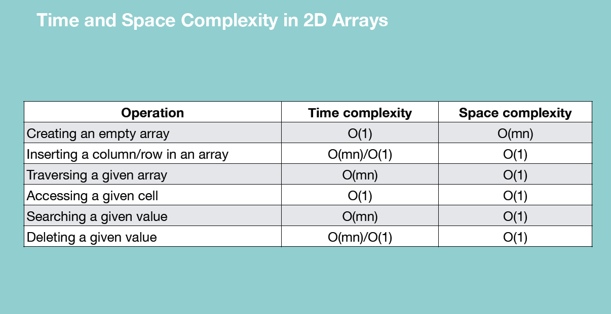


## Lists:

1.  List is a built-in data structure in Python. It comes with Python Standard Library
2.  A list is a data structure that holds an ordered collections of items.
3.  Main difference between **Array and Lists** is that the elements of a list don't have to be of same datatype. We can even have lists inside a list. 
4.  Example of list: myList=[1,2.0,'milk',[1,2,3,4],0.5,23,342,['test']]
5.  **lst.sort()**: sorts the list in place | **myList=sorted(lst)**: immutable operation
6.  **sorted_list_descending = sorted(my_list, reverse=True)**: Inorder to sort a list in DESC order
7.  **Accessing/Traversing list**: you can access the element of a list at index n as myList[n]
8.  **Insert and Append**: To insert and append we need to use:
                        <br>
                        To insert:  myList.insert(index,value)      --> This will insert the value on index and will push the rest of elements one step right <br>
                        To add an element at the end of list: myList.append(value) <br>
                        To add another list:  myList.extend(iterable) <br>
9.  **Update**: Update has TC of O(1) and SC is O(1). Since there just a replacement that happend. <br>
10. **Insert and Append**: Insertion has TC of **O(n) and SC is O(1)**. Since there just a replacement that happend. Append has TC of **O(1) and SC is O(1)**
11. **Extend**: Extend method has TC of O(n)  and SC of O(n) [(here n are the element of the new list)]
12. In order to update multiple elements we use slice:
        <br>myList[0:2]=['a','b'] --> This will change first two elements to 'a' and 'b'
13. **Deletion in List:**: <br>
- **myList.pop()** : mutable. Return last element. Results in deletion of last element from the list. <br>
- **delete() method**: del myList[index] or del myList[start:end] : mutable operation. Returns nothing. Deletes the value at index.<br>
- **remove(element_value) method**: Deletes the first occurence of that element.
14. SC for all deletion methods is O(1) and TC for some is O(1) if it is last element and it is O(n) if it is some element in between
15. **if target in myList**: This basically checks if target is in the list. It has O(n) TC. **"IN" operator has better TC when used with DICT and SETS. It is O(1)**
16. **Enumerate function**:  In Python, the enumerate() function is quite handy when you want to iterate over a list (or any iterable) while also keeping track of the index of the current item. It returns an enumerate object which contains tuples of index and value pairs.<br>
                        my_list = ['apple', 'banana', 'orange', 'grape']

                        for index, value in enumerate(my_list):
                            print(f"Index: {index}, Value: {value}")
17. **Liner Search through a list:** TC is O(n) and SC is O(1)
18. Operator for lists:
    <br> a+b : concats list
    <br> b=a*3: if a=[0] then b will be [0,0,0]
19. Functions of lists:
    <br>max(myList): return the max value in list
    <br>min(myList): return the min value in list
    <br>sum(myList): return the sum of all values in list. This has a time complexity of O(N) since it iterates through the entire string and computes the sum
    <br>sum(myList)/len(myList): this will give the average of all the elements in the list
20. The **.shuffle()** method in Python is used to randomly shuffle the elements of a list. It modifies the original list in place and does not return anything (i.e., it returns None).
    ```python
        import random

        my_list = [1, 2, 3, 4, 5]
        random.shuffle(my_list)
        print(my_list)
    ```
21. The **all() function** in Python returns True if all elements of an iterable are true (or if the iterable is empty), otherwise it returns False.
        <br> For eg. all(iterable)
22. The time complexity of sorting a Python array or list if **O(nLog(n))**

### STRINGS:
1.  If you use list(a) : where a is a string, then this will result in a list with each element being an alphabet of the string
2.  To convert a string into list: myString.split('delimiter')
3.  To covert a list into string: delimiter.join(myString)
4.  To count the occurence of a character inside a string we do:
    ```python
    my_string = "hello world"
    count = my_string.count("o", 0, 5) #0,5 tell us the index within which count is to be searched

    print(count)  # Output: 1
    ```

#### DRAWBACKS OF LISTS:
1.  Most of the list methods like .sort(), append(),remove(),etc return null value and are all mutable operations.
2.  There are multiple methods to do a particular operation on a list. This can create confusion
3.  If you are using a lot of Mutable methods....always make sure you make the copy of your original list. <br> To make copy do: orig=myList[:] OR orig=myList.copy()

#### Similarity between Lists and Array:
<br> Both are mutable, can be indexed and iterated through, can be sliced.

#### Difference between Lists and Array:
1. Array are optimized for Arithmetic operations.
<br> myArray=np.array([1,2,3,54,5])
<br> myList=[1,2,3,4,5]
<br> print(myList/2) --> not possible
<br> print(myArray/2) --> possible

2.  Data types have to be similar in Arrays, whereas in list they can be different


- **Time and Space Complexity of a List:**


#### LIST COMPREHENSION:
1.  new_list = [new_item for item in list] <br>
    For eg. new_list=[x**2 for x in prev_list]
2.  **x^2** doesn't calculate the square of x. Instead, it calculates the bitwise XOR of x and 2
3. *grid: 

##### CONDITIONAL LIST COMPREHENSION: 
1.  new_list=[new_item for item in list if condition] <br>
    For eg. new_list=[number**2 for number in myList if number > 0]
2.  Another way is: <br>
    new_list=[expression1 if condition else expression2 for item in iterable] <br>
    For eg. ```python new_list=[x**2 if x % 2 == 0 else 0 for x in nums] ```
3.  **.isalpha()** method is a built-in function in Python used to check whether all characters in a string are alphabetic characters (i.e., letters)
    ```python
        #For eg. string1 = "HelloWorld"
        print(string1.isalpha())  # Output: True

        string2 = "Hello World"
        print(string2.isalpha())  # Output: False
    ```
3.  You can write if-else statement in comprehesion format as well:
    <br> For eg. `return parm if parm>0 else 'negative number'`

## SETS:
Sets in Python are unordered collections of unique elements. They have several unique properties:

1. **Uniqueness**: Sets only contain unique elements. If you try to add a duplicate element, it won't be added to the set.

2. **Unorderedness**: Sets don't maintain the order of elements as they are added. When you iterate over a set or convert it to a list, the order of elements is arbitrary.

3. **Mutability**: Sets are mutable, meaning you can add or remove elements from them. However, the elements themselves must be immutable (e.g., numbers, strings, or tuples).

4. **Hashability**: Elements of a set must be hashable. This means that the elements must have a hash value that doesn't change over time and must be immutable.

5. **Fast membership testing**: Sets are optimized for fast membership testing. Checking whether an element is present in a set has an average-case time complexity of O(1).

Some of the commonly used methods of sets in Python include:

- `add(element)`: Adds an element to the set.
- `remove(element)`: Removes a specified element from the set. Raises a KeyError if the element is not present.
- `discard(element)`: Removes a specified element from the set if it is present. Does not raise an error if the element is not present.
- `pop()`: Removes and returns an arbitrary element from the set. Raises a KeyError if the set is empty.
- `clear()`: Removes all elements from the set.
- `copy()`: Returns a shallow copy of the set.
- `union(other_set)`: Returns a new set containing all unique elements from both sets.
- `intersection(other_set)`: Returns a new set containing only the elements that are common to both sets.
- `difference(other_set)`: Returns a new set containing elements that are present in the first set but not in the second set.
- `symmetric_difference(other_set)`: Returns a new set containing elements that are present in either of the sets, but not in both.
- `issubset(other_set)`: Checks whether all elements of the set are present in the other set.
- `issuperset(other_set)`: Checks whether all elements of the other set are present in the set.
- `isdisjoint(other_set)`: Checks whether the set has no elements in common with the other set.

6.  **SET COMPREHENSION**: Set comprehension is used to create a set based on existing iterables. It follows a specific syntax:<br>
    ```python
    set_val={expression for item in iterable if condition}
    #For eg:
    even_squares = {x**2 for x in range(10) if x % 2 == 0}
    print(even_squares)  # Output: {0, 16, 64, 4, 36}
    ```
## DICTIONARY:
1.  A dictionary is a collection that is unordered,changeable and indexed
2.  Python Dictionary **get()** Method return the value for the given key if present in the dictionary. If not, then it will return None (if get() is used with only one argument)<br>
    ```python
            #For eg. 
            
            Dict.get(key, default=None)
    ```
3.  Dictionary in Python are implemented in the backend using **HashMaps**
4.  To initialize a dictionary:
    ```python
                        my_dict=dict()
                        my_dict={} (another way)
    ```
    TC and SC is O(1). Only memory for initial hashtable is created

5.  Examples of **initialization**:
    ```python
        eng_sp=dict(one='uno',two='dos',three='trees')
                    
        print(eng_sp) --> this will print the keys as string
    ```
    **This is because you use the dict() function with keyword arguments, the keywords (such as one, two, and three) are automatically treated as strings representing the keys of the dictionary.**

6.  Another example of **Initialization**:

    `eng_sp2={'one':'uno','two':'dos','three':'tres'}`
7.  **TC and OC** of creating a dict is O(N)
8.  **How to initialize a dict using tuple:**
    ```python
    my_list_of_tuples=[('key1','value1'),('key2','value2'),('key3','value3')]
    my_dict=dict(my_list_of_tuples)
    ```
9.  Since a dictionary is actually implemented through a hashmap in the backend, so the under the hood assembly usually has three part: Key, Hashfunction, index and (Key,value) <br>

    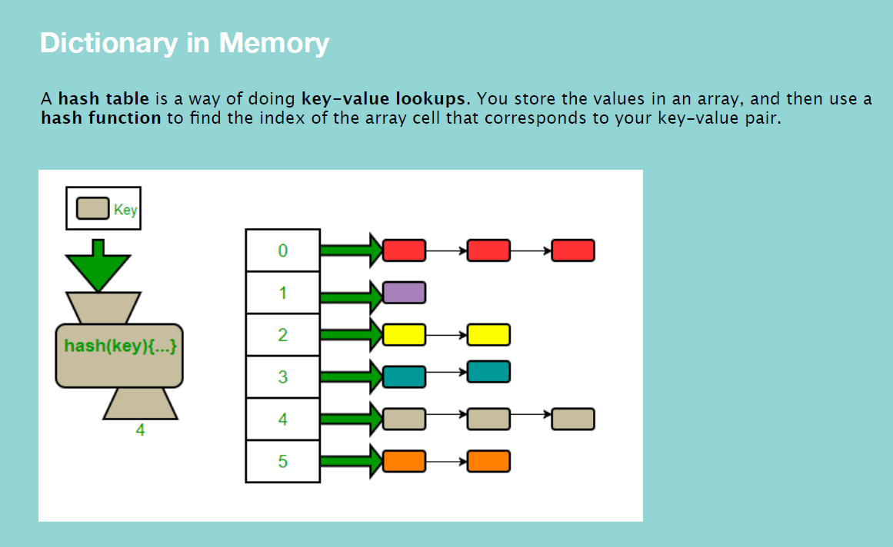
<br>

10. If a hashfunction outputs same index values for two keys, it is called as **collision**. In case of collision, the (key,value) pairs are stored as **linked list** in the backend.
<br>
    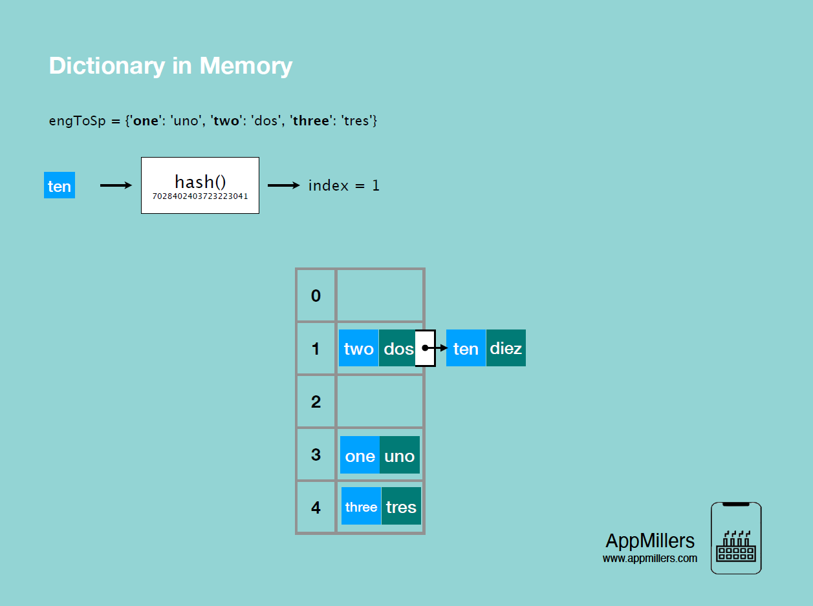

11. **Insert/Update in Dictionary:** 
    <br> myDict['key']=value (key can be an existing one or a new one)
    <br> **TC and SC is amortized O(N), O(1)** _[if we add key,value to a dic and its space threshold is reached, the space get doubled, hence amortized]_
12. **Traverse through a Dictionary:** 
    <br> for key in dict: ...then futher action
    <br> **TC and OC** is O(n) and O(1)
13. **Searching through a Dictionary**:
    ```python
    def searchDict(dict, value):
    for key in dict:
        if dict[key] == value:
            return key, value
    return 'The value does not exist'
    print(searchDict(myDict, 27))
    ```
  **TC and OC** is O(n) and O(1)  --> For linear search
  **TC and OC** is O(1) and O(1)  --> If you are using IN/NOT IN operator to do your search

14. **Delete/Remove from a Dictionary**:
    ```python
    del my_dict['age'] -->Inplace deletion
    print(my_dict)
    ```
    **TC and SC** for deletion is O(1) and O(1)
    
    ```python
    my_dic.pop(key,None) --> returns value corresponding to the key and deletes the key,value pair from that dictionary in place. None will be returned if no key found
    
    print(my_dict)
    ```
    **TC and SC** for popping is O(1) and O(1)

    ```python
    my_dic.popitem() --> return last key,value pair. Deletes that key,value pair inplace
    
    print(my_dict)
    ```
    **TC and SC** for popitem is O(1) and O(1)
    ```python
    my_dic.clear() --> returns none. Just removes all elements from the dictionary inplace
    
    print(my_dict)
    ```
    **TC and SC** for clear is O(n) and O(1)
15. **Dictionary methods**:
    <br> **dic.clear():** returns None. Just clears the dict in place
    <br> **dic.copy():**  returns a shallow copy of a dict. Doesn't modify the original one
    <br> **dic.fromkeys(sequence[],value)**: returns a new dictionary with given sequence as keys of dictionary. Value is optional.
    > For example: newDict={}.fromkeys([1,2,3],0) --> #output {1:0,2:0,3:0} . If you don't write 0 then it will put None as value
    
    <br> **dic.get(key,value):** returns value of the key. If key not present it return value (default is None)
    <br> **dic.items():** return view object that displays a key,value tuple pair. You can iterate over this
    <br> **dic.keys():** return a view object that displays a list of keys. You can iterate over this
    <br> **my_dic.popitem():**: return last key,value pair. Deletes that key,value pair inplace
    <br> **dic.setdefault(key,default_value):** Searches the key in the dic, returns the value of key if it is there and if it is not there it will insert the key with default_value in-place 
    <br> **dic.pop(key,default_value)**: return value of the key if it is present else returns default_value
    <br> **dic.values**: returns a view object that displays a list of all values. You can iterate over this.
    <br> **dic.update(other_dic or tuple_of_key_value_pairs):** Updates the dic with the elements from another dict or from an iterable of key,value pairs. If key is not in the dict...it adds, if it is then it updates.
    <br> For example:<br>
    ```python 
    myDict={'name':'Kshitij','age':23}
    newDict={'a':1,'b':2,'c':3}
    myDict.update(newDict) 
    print(myDict)
    #This returns {'name':'Kshitij','age':23,'a':1,'b':2,'c':3} 
    ```
16. **Dictionary operations:** <br>in/not in <br>len(): each pair is treated as one element <br> all(dic): returns True is all the keys are True (no key should be 0) <br> any(dic): returns True is any one value is True. If all of keys are false then it is false <br> sorted(dic): returns a sorted list of the keys of the dictionary

17. Difference between **Dictionary and List:** _(Dictionaries are ordered as of Python 3.7)_

    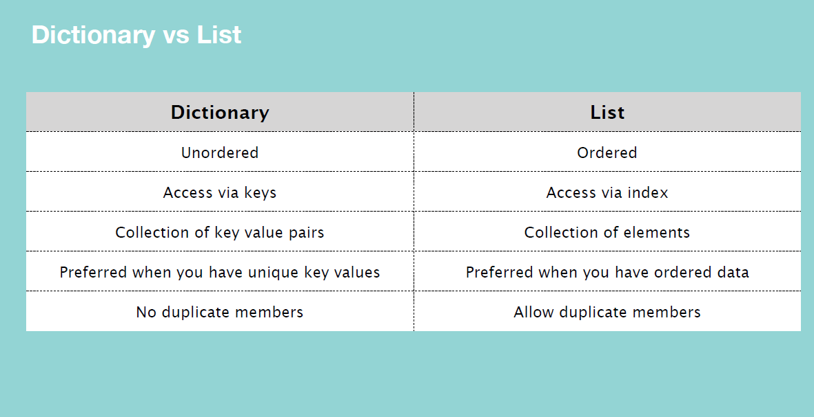
18. **Time and Space Complexity** of DICTIONARY:
    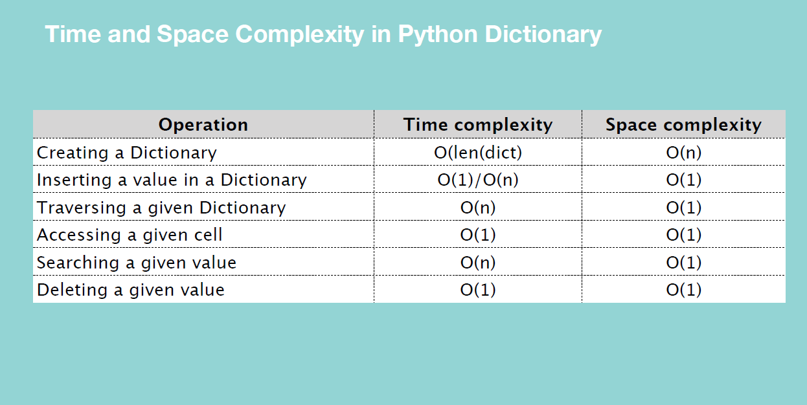

19. The key value of a dictionary have to be immutable. So, there can't be a dict that is having they keys as a list.
20. To delete a key from a dictionary, you do: del(dict1["key1"])


### DICTIONARY COMPREHENSION:
1.  ```python
    new_dic={new_key:new_value for item in list} #can be list or any other iterable
    new_dic={new_key:new_value for key,value in dic.items()}
    new_dic={new_key:new_value for key,value in dic.items() if condition}
    new_dic={city:random.randint(20,30) for city in city_name}
    
    ```

## TUPLES:

1.  Tuple is immutable sequence. Thus, **once you create them, they can't be changed**
2.  The values can be any type and they are accessed by indexes.
3.  They are hashable. That mean their values remain same in their lifetime.
4.  They are comparable
5.  Example of tuples: t=(1,2,4,5)
6.  **How to create Tuple?**
    ```python
    #Method1:
    init_tuple_a='a','b'
    #Method2:
    newTuple=('a','b','c','d')
    print(newTuple)
    ```
7.  To create a tuple with **just one element**:
    <br> newTuple=('a',)    --> How you intialize a singleton tuple
8.  **Creating tuple with built-in tuple function**:
    ```python
    newTuple=tuple() -->Initialize an empty tuple
    newTuple=tuple('abcde') --> #output: ('a','b','c','d','e')
    ```
9.  The tuple() function in Python converts an iterable (such as a string, list, or another tuple) into a tuple. When you pass a string to tuple(), it treats the string as an iterable of characters. This means each character in the string becomes an individual element in the resulting tuple.
10.  **TC is O(1) coz you are defining all the elements upfront. SC is O(N)**
11. **Access element of Tuple:** newTuple[0] or newTuple[start:end] |  **TC and SC** is O(1)
12. **Traverse Tuple**: 
    ```python
    for i in newTuple:
        print(newwTuple[i]) 
    ```
    TC and SC is O(N) and O(1)
13. **Searching in Tuple**: 
    ```python
    #Method1:
    'a' in newTuple --> outputs a boolean | IN works as linear search so TC: O(N) 
    #Method2: 
    for i in newTuple:
        if i==target:
            print(str(i)+' is present at '+str(newTuple.index(i)))
    ```
    TC and SC of search is O(N) and O(1)
14. **Tuple operations**:
    ```python
    myTuple = (1,4,3,2,5)
    myTuple1 = (1,2,6,9,8,7)

    print(myTuple + myTuple1) #Concatenate
    print(myTuple * 4) #Multiply this tuple 4 times. Output myTuple+myTuple+myTuple+myTuple
    print(2 in myTuple1)      #Search in Tuple 

    myTuple1.count(2)         #gives the count of element inside tuple  
    myTuple1.index(2)         #gives the index of element inside tuple  
    ```
15. There are no operations in Tuple that **ADD,DELETE,REMOVE,UPDATE,INSERT** elements in tuple since they are **immutable**
16. **len(myTuple)**: returns the number of elements in a tuple
17. **max(myTuple), min(myTuple)**: return the max and min value in tuple
18. **tuple**: Converts a list into tuple. For eg. tuple([1,23,4534,3634,23])
19. Tuples are comparable:
    ```python
    init_tuple_a='a','b'
    init_tuple_b=('a','b')
    init_tuple_a==init_tuple_b #this will return TRUE as both tuples are containing the same elements
20. A unique way of wirting list compreshension: 
    ```python
    init_tuple = [(0, 1), (1, 2), (2, 3)]
    sum(n for _, n in init_tuple): In this For each tuple, it unpacks the tuple into two variables _ and n. The underscore _ is a conventional way to indicate that the variable is not going to be used.
    ```
### TUPLE V/S LISTS
1. **Difference between Tuple and List**:
    - Tuple is immutable and List is mutable
2. **Common function that can be used for both List and Tuple**:
    - len(),max(),min(),sum(),any(),all(),sorted()
3. Tuples can be stored in lists. Lists can be stored in tuples.
4. Both list and tuple can be created in a **nested** fashion:
    <br> myTuple=((1,2),(3,4))
5. **Time and Space complexity** of TUPLE operations:<br>
    
    
 
## Object Oriented Programming (OOP):
1.  There are two types of software development paradigms: OOP and Procedural
2.  **Procedural:** Focuses on functions and sequential execution,Linear, top-down approach,Data and functions are separate,Reuse through functions,Can be harder to maintain as programs grow.
3.  **Object Oriented:** Focuses on objects, which encapsulate data and methods,Linear, top-down approach,Data and functions are separate,Reuse through functions,Can be harder to maintain as programs grow.
4.  In OOP we develop code in a modularized fashion in which each module has a certain funcitonality. This module is re-usable based on requirement.
5.  **Parts of OOP**: 
    -   Classes
    -   Objects
    -   Attributes
    -   Methods
6.  What an object **has** is the **attributes** and what that object **does** is the **method**
7.  You can create multiple object instaces of a class that you have created
8.  **Objects:** The current state of one object instance doesn't determine the state of another object.
9.  **Objects:** All objects in OOP paradigm aree represented by **Identity, Attributes and Behaviour**
10. **How to know if you need Objects:** Your objects will usually be **Nouns** and your methods will be **Verbs**
11. In Python you have **Python Standard Library** which has 1000s to pre-defined classes in them.
12. **Class**: It is a detailed description, definition, the template of what an object will be. Class are written in Pascal Case. First letter is capital. 
13. **Object**: Object are written in lower case with underscore in between them
14. **Object.Attribute**: Way to reference the attribute of an object. For eg. Robot.batter_life
15. Functions that are associated with a particular object are called its **behaviour or object methods.**
16. **Way to call object methods:** Object.Method --> For eg.   robot.detect_speech()
17. From a **Class** we can create **multiple objects** with different attributes.
18. Three components of Class: 
    -   Class Name
    -   Attributes
    -   Behaviour
19. **Method:** They are block of code or program procedure that can be called to perform some actions and it may return a value
20. **Method vs Function**: Method are function that are defined as part of class. Their scope of data is only limited to that class attributes.
21. **Creating object** is called **Instantiation**
22. **String, Date , Arrays, etc** are pre-defined in PSL.
23. Different Types of cases in Python: **PascalCase, camelCase, snake_case**
24. How to put attribute in a class object?
    ```python
    star_cookie=StartCookie()
    star_cookie1.weight=15
    star_cookie1.color="Red"
    print(star_cookie1.weight)
    print(star_cookie1.color)
25. **Initializer**: It is used to initialize an object. In Python we use **__init__(self)** to initialize the attributes. _self_ is the object itself
26. Whenever you will create an object of the class it will execute whatever is inside your initializer function. Also, make sure you include all the attribute that are there in initializer function when you are creating the object. You can avoid including all the attributes in case you have kept some default value for the attribute.
    ```python
    class Youtube:
        def __init__(self,username,subscriber=0):
            self.username=username
            self.subscriber=subscriber
    user1=Youtube("kshitij")        #no need to include value of subscriber since that will be the default value
    print(user1.username)
    print(user2.subscriber)
    ```

27. In the above code, if I say write user1.follower=3 then this will create a new attribute to the object instance (even if we have not mentioned those attributes in the __init__ function)
28. **Class attributes** are variables that are global in nature, so **every object will have those variables as their attributes**
    ```python
    class Youtube:
        country='India'
        def __init__(self,username,subscriber=0):
            self.username=username
            self.subscriber=subscriber
    #So if I create two object from this:
    user1=Youtube('kshitij')
    user2=Youtube('Jill')
    print(user1.country)
    print(user2.country)        
    print(Youtube.country)      #You can print the attribute for the class as well and all will yield the same value
    ```
29. **NameSpace**: It is a dictionary in which keys are the objects attribute names and values are the objects attribute values.
20. **To access name space**: you can do <object_name>.__dict__
21. **If you create a new attribute for the object** and the name of that attributes matches the class attribute then **the newly created attribute value for that object will become the new value of that specific object and it will overwrite the value that class has given to it**
    ```python
    class Youtube:
        country='India'
        def __init__(self,username,subscriber=0):
            self.username=username
            self.subscriber=subscriber
    user1=Youtube('kshtij')
    user1.country='US'
    print(user1.country)        #This will output: US

#### Obejct Methods:
1.  These are the behaviour of the object
2.  **To define:**
    ```python
    class Robot:
        def enter_charge_mode(self): #self will always be the first param of your method
            self.battery_leve += 1
    ```
3.  **How to call:**
    ```python
    my_robot.enter_charge_mode()
    ```

## LINKED LIST

1.  It is a form of a sequential collection and it does not have to be in order.
2.  LL have nodes (they have refrences), tail and head. Each node is independent.
3.  The nodes of LL in memory are not contiguous. Nodes have two parts: value and reference.
4.  Head is important to locate the starting point of a LL
5.  Reference is basically the physical location of a node in memory.
6.  Tail has null as the reference.
7.  **Tail is needed** as it increases the efficiency of insertion in the end of LL, otherwise you will have to traverse the entire LL

### Linked List V/s Python List
1.  PL have index and LL don't have indexes
2.  In PL elements are contiguous in memory whereas in LL they are not contiguous
3.  In LL we have head and tail, each node points to the next node and so on. 
4.  LL nodes are spread out in different physical location in memory and you can use the pointers to traverse the entire linked list. 

### Different Types of Linked List
-   Single LL
    - Each node stores data and reference to next node
    - There is flexibility of adding and removing nodes at run time  
-   Circular Singly LL
    - The last node stores reference to the first node. So the tail node stores reference to the fist node
    - This kind of data structure is useful when you are playing a 4 player chess. 
-   Doubly LL
    - Two references are there in each node. One for the previous and one for the next
    - So, a node has a value, one prev node reference and one next node reference
    - It provides us flexibility of traversing in both the direction
    - Useful in implementing a music app where you have to shuffle between next and previous song
-   Circular Doubly LL
    - Here along with having two references in each node, we have references for Head in tail and vice-versa
    - Useful in implementing the cmd+shift+tab feature of Mac.
    - It basically moves to the first icon when you move to the right of last node

### How LL are stored in Computer Memory
1.  The elements of LL are not created contiguously in memory
2.  The size doesn't have to specified during creation
3.  To access a element you will have to traverse the LL starting at HEAD
4.  So element access is costlier operation than a python list

### Creation of Single Linked List in memory
1.  Node is bascially: **Value, Pointer**
2.  So node is basically a dictionary with Value,next as the keys and their values are the value of Value and next
3.  Implementation of a node:
    ```python
    class Node:
        def ___init___(self,value):
            self.value=value
            self.next=None
    ```
4.  Time Complexity for creating Node class: O(1) _(It's just an assignment operation)_
5.  Space Complexity for creating Node class: O(1) _(We are only initializing only two attributes and they occupy a constant space)_
6.  Creating a single node SLL takes:
    - TC is O(1)
    - SC is O(1)

### Insertion in a SLL and it takes place in memory
1.  Insertion can happen in beginning, middle or end of a LL
2.  For append method, the **Time Complexity** is O(1) and **Space Complexity** is also constant i.e O(1)


### Printing a SLL
1.  In this we will be using ___str__ method. This represents a special class method that provides a string representation of an object
2.  During implementation this looks like this:
    ```python
    def ___str__(self):
        return f"Person {self.name} - {self.age}"
    #This will output the fstring when you write: print(new_person)  [here new_person is the object]
    ```
3.  You should write your print method after your constructor (initializer)

### Prepend a SLL
1.  Change the pointer of new node next attribute to current head
2.  Change the current head of LL to new node
3.  **Time and Space complexity** of Prepend operation is **O(1)

### Inserting an element at a specific location in LL
1.  Here we take a value and an index as a parameter
2.  How to insert? Change the next of new_node to next node and change the next of current node to new_node
3.  We use _ in for loop when we are not going to use the iterating variable inside loop:
    ```python
    for _ in range(index-1):
        #here i am not going to use _ inside my loop
    ```
4.  We can't insert an element in negative index or an index value that is greater than the length of linked list
5.  **Time complexity** of insertion at a particular index is **O(N)**
6.  **Space complexity** of insertion at a particular index is **O(1)**

### Traversal of Linked List
1. Traversal has to be implemented since unlike array linked list is not stored in contiguous blocks
2.  Search, update , delete require traversal in a linked list
3.  Traversal method is also implemented inside linked list class
4.  **Time Complexity** is O(N) and **Space Complexity** is O(1)

### Search Method in a linked list
1.  You can write a method that either return a boolean for search method or it can even return a index
2.  **Time Complexity** is O(N) and **Space Complexity** is O(1)

### Get Method in linked list
1.  **Time Complexity** is O(N) and **Space Complexity** is O(1)

### SET Method in linked list
1.  **Time Complexity** is O(N) and **Space Complexity** is O(1)

### Pop first mehtod in linked list
1.  Pop first method removes the first node from the linked list and returns that node
2.  Steps to do this:
    - Change the head to point to the second node
    - Change the next pointer of the first node to None
3.  pop_first() will also be declared inside the single linked list class
4.  If you implementing the pop_first method on a single node linked list then you will see that post popping, the tail value of the sll still points to the popped node value
5.  Because of this the grabage collector will not be able to delete the popped node since it is still being referenced
6.  To avoid this we will have to update the pop_first method to accomodate that edge case
7.  Similarly we will have to cover the edge case where the linked list is not having any node
8.  **Time Complexity** is O(1) and **Space Complexity** is O(1)

### Pop Last Method in Linked List
1. **Description**: The `pop_last` method removes and returns the last node from the linked list.

2. **Steps**:
    - Traverse the linked list to find the second-to-last node.
    - Change the tail of the linked list to second-to-last node.
    - Update the next pointer of the second-to-last node to None.
    - If the linked list has only one node, update both the head and tail to None.

3. **Declaration**: The `pop_last` method is declared within the singly linked list class.

4. **Single Node Edge Case**:
    - If the linked list has only one node, after popping, both the head and tail should be set to None to avoid lingering references.

5. **Empty List Edge Case**:
    - Ensure the `pop_last` method correctly handles cases where the linked list is empty by returning None or an appropriate response.

6. **Complexity**:
    - **Time Complexity**: O(n) due to the need to traverse the list to find the second-to-last node.
    - **Space Complexity**: O(1)

### Remove method in Linked List
1.  Remove a specific node that is located at a specific index
2.  Here we focus on prev and popped_node
3.  We first make the next reference of prev node to node located after popped node
4.  The next reference of popped node is stored to None
5. **Time Complexity** is O(N) as pop() and get() method require O(N) time complexity and **Space Complexity** is O(1).

### Delete all nodes from a linked list and make it empty linked list
1.  Here you just need to remove the reference for head and tail from this linked list
2.  Once there is no way to figure out the start and end of a linked list, the garbage collector will automatically delete all the nodes in between that head and tail
3.  **Time Complexity** of delete_all() is O(1) and **Space Complexity** of delete_all() is O(1)


## STACK

### What is STACK Data Structure and Why do we need it?
1.  Stack is a data structure that store items in a **LIFO** manner
2.  Examples of stack: Pile of plates
3.  We need stack data structure **when we want the last coming information first**
4.  In real computer science world while implemeting the **Back Button** in a website we use the **STACK** data structure


### Different STACK Methods
1.  `push()`: 
    - This deals with inserting the element in a stack
    - Every time you push an element in the stack, it will be placed on top of previous element
2.  `pop()`
    - Gives the last inserted element. 
    - The popped element is deleted from the stack
    - **Returns**: Popped element
    - We can't do a pop() if the stack is empty
3.  `peek()`
    - This returns the top element of a stack
    - The top element is not removed, so the number of element in the stack remain the same
4.  `isEmpty`
    - To check if there is any element in the stack
    - Return True is not empty and False if otherwise

5.  `isFull()`
    - In some **programming language** when you create a stack based on an array, you need the define the size of the array when you declare it
    - It means that size of the stack is limited
    - When that limit is reached you can't insert further element in that stack
    - In case of Python list we don't have any size limit, hence this method is not required

6.  `delete()`
    - In we need convert the list element into an empty list
    - All elements are deleted

### Creation of Stack
1.  Following are ways to create a STACK:
    - Using a Python List with a size limit
    - Using a Python List without size limit
    - Using a linked list

2.  Stack implemented using List deals with **Speed issues as it grows** as since a Python list in the backend stores element as contiguous blocks of memory so as the size of stack grows **memory allocation becomes times consuming**

3.  Stack implemented using Linked List are **faster** since **LL doesn't stores elements as contiguous blocks of memory** so there is no issue of memory allocation as the size of stack grows. 

4.  Stack implementation is difficult with LL incomparison to List

5.  For creation of an empty stack: 
    - **Space Complexity** is O(1)
    - **Time Complexity** is O(1)

### Operations on Stack using List

- <H4><u> ALL OF THESE METHODS ARE IMPLEMENTED WHEN THERE IS NOT SPACE CONSTRAINT ON THE LIST </u></H4>

1.  `isEmpty()`: Check if the stack is Empty or not (returns True or False). **TC** is O(1) and **SC** is O(1)
2.  `push()`: **TC** is Amortized Constant and **SC** is O(1)
3.  `pop()`: **TC** is O(1) and **SC** is O(1)
4.  `peek()`: **TC** is O(1) and **SC** is O(1)
5.  `delete()`: **TC** is O(1) and **SC** is O(1)

- <H4><u> ALL OF THESE METHODS ARE IMPLEMENTED WHEN THERE IS A SPACE CONSTRAINT ON THE LIST </u></H4>

1.  The maximum number of elements in this Stack is pre-defined
2.  For initialization: **TC** is O(1) and **SC** is O(1)
3.  `isEmpty()` and `isFull()`: **TC** is O(1) and **SC** is O(1)
4.  `push()`: **Amrotized Time Complexity** is O(1)...can range to O(N) incase resizing is required. **Space Complexity** is O(1)
5.  `pop()` `peek()` `delete()`: For all of them **TC** is O(1) and **SC** is O(1)

### Operations on Stack using Linked List
1.  First you create an object of a Linked List class
2.  Here you first create a blank node and then point the Head to this blank node
3.  You then push a value to the created blank node
4.  Create another blank node and push another value to it. Then change the next pointer of first node to this second node
5.  Then change the head pointer to second node since stack is LIFO
6.  **All in all, whenever you are inserting a value into a stack, you are esentially pushing a value to the starting of the linked list**
7.  `pop()`: Returns the head node, then removes the head node and changes the head to next node of the stack. The removed first node is automatically deleted by garbage collector
8.  `peek()`: Returns the head node of the stack.
9.  `isEmpty()`: If Head pointer is None then it's True else False
10. `delete()`: It simply makes the head pointer equal to None


    <h4> `def __iter__(self):` - This line defines the `__iter__ method for the LinkedList class. The `__iter__` method is a special method in Python that returns an iterator for an object. It allows the linked list to be iterated over using a for loop.</h4>

        
    ```python
            def __iter__(self):
                curNode = self.head
                while curNode:
                    yield curNode
                    curNode = curNode.next
    ```

    `yield curNode` - The yield statement is used to return the current curNode from the iterator. It allows the code iterating over the list to receive the current node and pauses the execution of the `__iter__` method until the next item is requested

11. Creation of Stack using Linked List: **TC** is O(1) and **SC** is O(1)
12. `isEmtpy()` : **TC** is O(1) and **SC** is O(1)
13. There is no `isFull()` method in case of stack implemented through a linked list
14. `push()` : **TC** is O(1) and **SC** is O(1)
15. `pop()`: **TC** is O(1) and **SC** is O(1)
16. `peek()`: **TC** is O(1) and **SC** is O(1)
17. `delete()`: **TC** is O(1) and **SC** is O(1)
18.  Stack implemented using linked list **have constant time and space complexity** for **all** the operations


<h3> <u>TIME AND SPACE COMPLEXITY of a Stack </u><i>(implemented using Linked List):</i></h3><br>

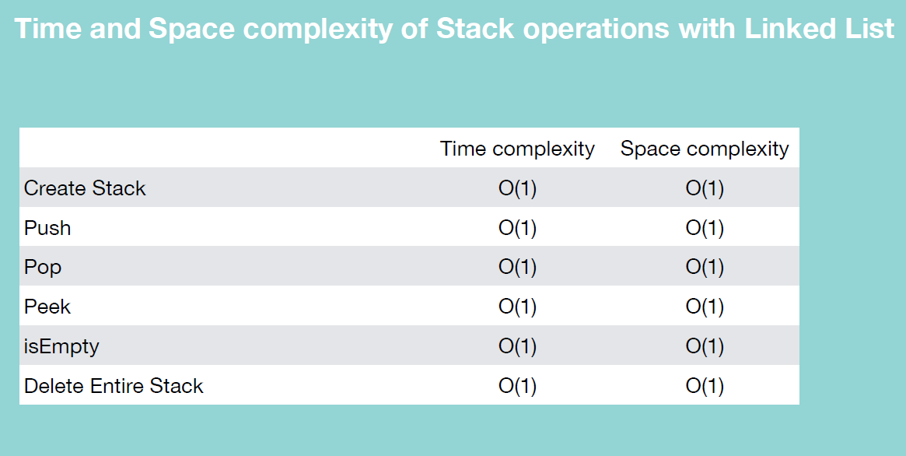


<br>

### When can we use stack and when should you avoid it?
**You use stack :**<br>
1.  When implementing LIFO functionality
2.  The chance of data corruption is minimum since only last element can be accessed

**You use don't stack :**<br>
1.  Random acces is not possible since only last inserted element can be accessed

## QUEUE

### What is QUEUE Data Structure and Why do we need it?
1.  Queue is a data structure that stores data in **FIFO method**
2.  A new addition ot the queue happens at the end of the queue
3.  We need queue when we need to create an application which utilize first coming data first
4.  Eg. Point of sale system in a restaurant....first order is delivered first
5.  Eg. Printer queue, Call center phone system

### Standard operations on QUEUE
-   Create Queue
-   Enqueue
-   Dequeue
-   Peek
-   isEmpty
-   isFull
-   deleteQueue

### Ways to implement queue
-   Using **Python List**
    -   Without capacity
    -   With capacity (queue with capacity is called as cicular queue)
-   Using **Linked List**

### Operations on Queue (Implemented using Python List):

- <H4><u> ALL OF THESE METHODS ARE IMPLEMENTED WHEN THERE IS NO SPACE CONSTRAINT ON THE LIST </u></H4>

0.  `create`: **Time and Space Complexity** is O(1)

1.  `enqueue()` (Insert)
    -   This operation adds an element to the back (or rear) of the queue
    -    If the queue is `[1, 2, 3]` and you enqueue the element 4, the queue becomes `[1, 2, 3, 4]`
    -   **Amrotized Time Complexity** is O(1)...can range to O(N) incase resizing is required.
    -   **Space Complexity** is O(1)


2.  `dequeue()` (Remove)
    -   This operation removes an element from the front of the queue and returns the first inserted element
    -   If the queue is `[1, 2, 3, 4]` and you dequeue an element, the queue becomes `[2, 3, 4]`, with the element 1 being removed
    -   It raises an error if the queue is empty
    -   **Time Complexity** for dequeue is O(N)...since if you remove the first element from the list then the rest of the elments have to be moved one step to the left
    -   **Space Complexity** is O(1)

3.  `peek()`: First inserted element is returned.
4.  `isEmpty()`: Checks if the queue is empty or not. 
5.  `isFull()`: Applicable only in case of Space constraint queue, checks if the queue is full or not. 
6.  `delete()`: Deletes all the elements of a queue.
7.  **Time and Space Complexity** for all these methods is O(1) 


    


- <H4><u> ALL OF THESE METHODS ARE IMPLEMENTED WHEN THERE IS A SPACE CONSTRAINT ON THE LIST </u></H4>
    - <H5><u> A Queue (with Space Cap): CIRCULAR QUEUE</u></H5>

1.  Here you  initialize a Queue with size, top and start attributes
2.  `Top` value changes on enqueue and `Start` value changes on dequeue
3.  Since there is **never** a removal or addition of list nodes therefore the issue of dynamic memory allocation and shifting the elements to left on removal of a element is gone
4.  `peek` method will return the value in `start` attribute
5.  `isFull` if `Start` points to 0 and `Top` points to the last element then that means the queue is full 
6.  `isEmpty` checks if the queue is having any None value of not
7.  `delete` assigns `Start` and `Top` to -1

    **Time and Space Complexity of a Circular Queue**

    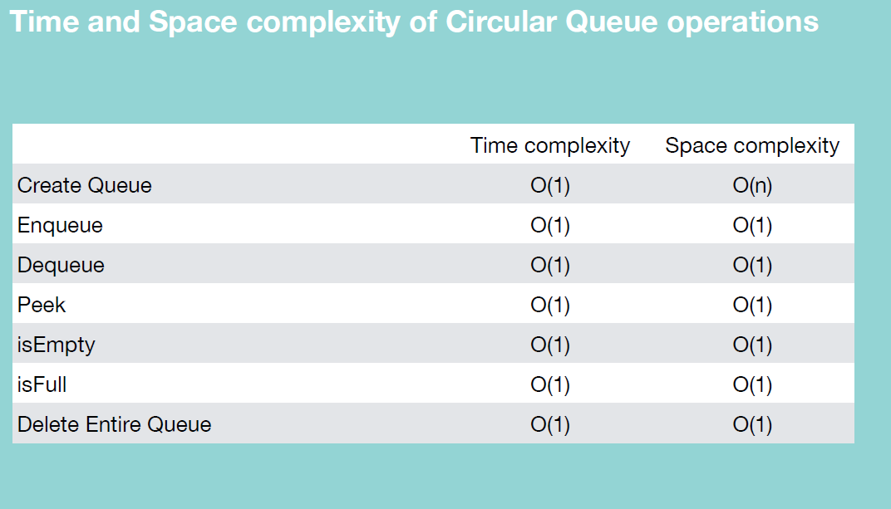


### Operations on Queue (Implemented using Linked List):

1.  Creation of a Queue using SLL includes creation of a blank head and blank tail
2.  `enQueue()` involves changing the tail pointer and the next pointer of last node to the new node
3.  `deQueue()` involves removal of first node element. This includes chaning the head reference to the second node and then first node is ready for garbage collector
4.  `peek()` return the first node (head) value aka head.value
5.  `isEmpty` method checks if head reference points to None
6.  `isFull` not applicable for Linked List based queues since there is no prior space allocation required
7.  `delete()` here we have to set the head and tail reference to None

    **Time and Space Complexity of Queue (implemented using Linked List)**

    


### Time nad Space Complexity Comparison between all types of implementation of Queues


### Python Queue Modules
-   **Collections Module**
-   **Queue Module**
-   **Multiprocessing Module**

<br>
<br>
<br>

- **Collections Module**
1.  collections.deque class objects are implemented as double linked list
2.  They have the functionality for enqueuing and dequeuing from both ends.
3.  For the FIFO queue kind of implementation, we would need following methods from the collections.deque class:
    -   deque()     --> for creation
    -   append()    --> adding elements to end of queue
    -   popleft()   --> similar to dequeue, return first element and removes that element
    -   clear()     --> removes all element from the queue
4.  If a deque object is full (and it is defined with a max size) then if you append another element in it, it will **remove the first added element to make space for the new element**

- **Queue Module**
1.  Used to implement multi producers and multi consumer queues
2.  Used in threaded programming, where information has to be shared safely between threads
3.  It implements queues in three ways:
    - FIFO --> First added is first retrieved
    - LIFO --> Last added is first retrieved
    - Priority --> entries are kept sorted and lowest value is retrieved first
4.  Use the Queue class. Queue(maxsize=0)
5.  If maxsize is less than zero then queue size is infinite
6.  Following methods are most commmon for FIFO type implementation:
    -   qsize()     -->return the approx size of a queue
    -   empty()     -->checks if the queue is empty
    -   full()      --> checks if the queue maxsize is reached
    -   put()       --> same as enqueue method
    -   get()       --> removes element from the start of queue and returns it
    -   task_done() --> indicates that a formally enqueued task is complete used by queue consumers trace
    -   join()      --> this blocks until al items in the queue have been gotten and processed 


- **Multiprocessing Module**
1.  In Multiprocessing Module we use Queue
2.  Here queue is shared job of implementation that allows queue items to be processed in parallel by multiple concurrent workers
3.  Used for sharing data between processers
4.  Common methods:
    -   get()
    -   put()
    .....rest of the methods are similar to Queue from Queue module


## RECURSION

### Basic Definition:
1.  Performing the same operation multiple times with different inputs
2.  In every step we try smaller inputs to make the problem smaller
3.  Base condition is need is needed to stop the recursion, otherwise infinite loop will occur

### Where to use recursion:
1.  If you can divide the problem into similar sub problems
2.  Design an algorithm to compute the nth....
3.  Write a code to list the nth...
4.  Implement a method to compute all....

### Used in which areas?
1.  It is heavily used in data structures like **trees and graphs**
2.  Used in many algos (including divide and conquer, greedy and dynamic programming)

### How Recursion works?
1.  There are two conditions to be kept in mind:
    -   **A method calls itself**
    -   **Exit from infinite loop**
    ```python
        def recursionMethod(parameters):
            if exit from condition satisfied:
                return some value
            else:
                recusionMethod(modified parameter)
    ```
2.  As we keep going deeper into that recursion tree the **upper layer of methods start getting inserted into the stack memory**
3.  When you are at the bottom most layer of your recursion tree, your stack will have **n-1 methods** in it. (where n is the total number of layers in your recursion tree)
4.  When the code starts coming out of your recursion tree then the methods **will be called out of stack memory. The methods will be popped out from Stack memory as per the LIFO rule**

### Recursive v/s Iterative Solutions:
1.  Recursion code is more **neat** and contains few line of code
2.  Exit from Recursion is done using **a condition** where as in Iteration exit happens using a **a control variable**
3.  Infinite Recursion can cause system crash whereas Infinite Iteration utilizes CPU cycles
4.  Recursion is **not space efficient** whereas Iterative algo is.


### When to avoid Recursion??
 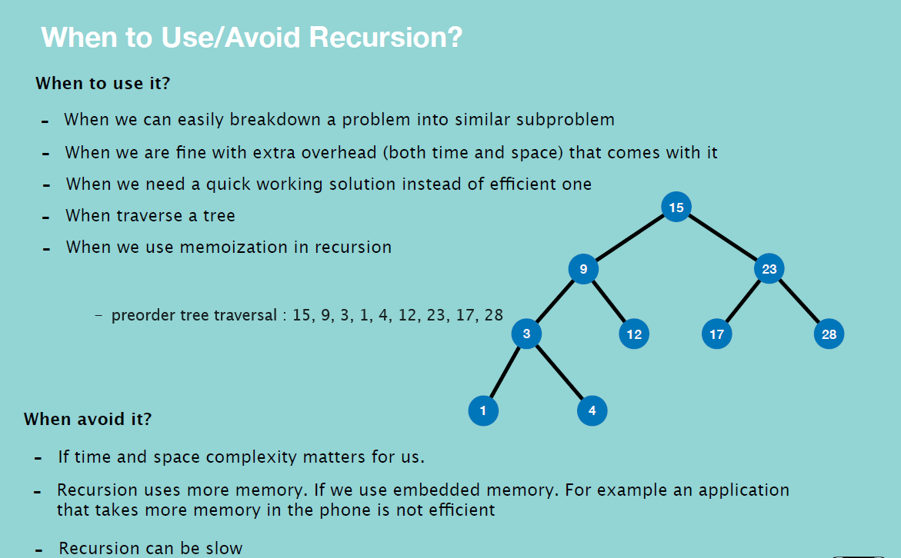


### How to write a Recursive function?
1.  Find the recursive case.
    For eg. in case of factorial:` n! = n*(n-1)!`
2.  Find the base case.
    For eg. in case of factorial: `1 if n in [0,1]`
3.  Unintentional case - the constraint
    The function will reach the base case only if the input is within the constraints
    For eg. in case of factorial: `input should be non-negative`
    ```
    #checking for constraint
    assert condition, optional_message
    ```
    ```python
    #incase of factorial
    assert n>=0 and int(n)==n, 'The number must be a positive integer only!'
    ```
### Time and Space complexity of Recursive function
-   **Single call in a function pass**: 
    -   **TC** is O(N)
    -   **SC** is O(N)
-   **Double call in a function pass**
    -   **TC** is 2^N
    -   **SC** is O(N)


**Tip: In order to change the recursion depth in VS code:**
```
import sys
sys.setrecursionlimit(1000) #here 1000 is the depth of your recursion
```

### MASTER THEOREM: 

The **Master Theorem** is a tool used to analyze the time complexity of recursive algorithms, especially when the recurrence relation fits a particular form. It is commonly used in algorithms like merge sort, binary search trees, and divide-and-conquer problems.

### The General Form of the Recurrence Relation
The Master Theorem applies to recurrence relations of the form:

$$ T(n) = a \cdot T\left(\frac{n}{b}\right) + O(n^d) $$

where:
- **`a`** ≥ 1: The number of subproblems the original problem is divided into.
- **`b`** > 1: The factor by which the problem size is reduced in each recursive call.
- **`O(n^d)`**: The time complexity of the "conquer" or "combine" step, where `d` is a constant.

### The Master Theorem Cases
The Master Theorem provides three cases that determine the overall time complexity:

1. **Case 1:**
   - If **`d < log_b(a)`**, then:
     $$ T(n) = \Theta(n^{\log_b(a)}) $$
   - **Explanation:** When the work done at each level decreases faster than the number of subproblems, the complexity is dominated by the number of recursive calls.
   - **Example:** `T(n) = 2T(n/2) + O(1)` results in `O(n)` because `d = 0` and `log_2(2) = 1`.

2. **Case 2:**
   - If **`d = log_b(a)`**, then:
     $$ T(n) = \Theta(n^{\log_b(a)} \cdot \log n) $$
   - **Explanation:** When the work done at each level is balanced by the number of subproblems, the overall complexity will include a logarithmic factor.
   - **Example:** `T(n) = 2T(n/2) + O(n)` results in `O(n log n)` because `d = 1` and `log_2(2) = 1`.

3. **Case 3:**
   - If **`d > log_b(a)`**, then:
     $$ T(n) = \Theta(n^d) $$
   - **Explanation:** When the work done at each level increases faster than the number of subproblems, the complexity is dominated by the work done at the top level.
   - **Example:** `T(n) = 2T(n/2) + O(n^2)` results in `O(n^2)` because `d = 2` and `log_2(2) = 1`.

### Applying Master Theorem to Merge Sort:
For merge sort, the recurrence relation is:
$$T(n) = 2T(n/2) + O(n)$$
- **`a = 2`** (two subproblems),
- **`b = 2`** (each subproblem is half the size of the original),
- **`d = 1`** (linear time to merge the subarrays).

Here, `log_2(2) = 1`, which matches `d = 1`. So, it falls under **Case 2** of the Master Theorem, resulting in:
$$
T(n) = O(n \log n)
$$

### Summary
The Master Theorem is a helpful tool to quickly determine the time complexity of recursive functions when they fit a specific pattern. Understanding how `a`, `b`, and `d` relate allows you to apply the appropriate case and find the overall complexity.

## TREES

### Binary Trees

### What is a Tree?
- A **Tree** is a **non-linear data structure** with a hierarchical relationship between its elements, without forming any cycles.
- **Real-life Example**: A café menu with categories like Hot Drinks and Cold Drinks, further divided into subcategories, forms a tree structure.

#### Properties of a Tree
1. **Hierarchical Structure**: Represents data in a hierarchy, moving from general (root) to specific (leaves).
2. **Node Components**: Each node has:
   - Data.
   - References (or pointers) to its children.
3. **Root Node**: The topmost node without any parent.
4. **Subnodes**: Nodes under the root, each forming subcategories.

---

### Why Do We Need Trees?
- **Efficiency**: Compared to linear data structures (arrays, linked lists), trees provide faster access and better performance for hierarchical data.
- **Applications**:
  - Hierarchical data (e.g., folder structures, XML/HTML data).
  - Fast search, insert, and delete operations (e.g., Binary Search Trees, AVL Trees).
  - Specialized problems like Huffman Coding and Expression Parsing.

---

### Binary Trees
- **Definition**: A type of tree where each node has at most two children, referred to as the **left** and **right** children.
- **Examples**:
  - **Binary Search Tree (BST)**.
  - **Heap Tree**.
  - **AVL Tree**.
  - **Red-Black Tree**.

#### Importance of Binary Trees
- **Foundational**: Prerequisite for advanced tree structures like BST, AVL, and Red-Black Trees.
- **Applications**:
  - Huffman Coding.
  - Expression Parsing.
  - Priority Queues (Heap Trees).

---

### Types of Binary Trees
1. **Full Binary Tree**: Every node has either 0 or 2 children (no single-child nodes).
2. **Perfect Binary Tree**: All internal nodes have 2 children, and all leaf nodes are at the same level.
3. **Complete Binary Tree**: All levels are fully filled except the last, where nodes are as left-aligned as possible.
4. **Balanced Binary Tree**: The depth of any two leaf nodes differs by at most one.

---

### Binary Tree Terminology
1. **Root**: The topmost node without a parent.
2. **Edge**: A link between a parent and a child.
3. **Leaf**: A node without children.
4. **Sibling**: Children of the same parent.
5. **Ancestor**: Parent, grandparent, or any predecessor of a node.
6. **Depth**: Number of edges from the root to the node.
7. **Height**:
   - Of a node: Number of edges from the node to the deepest leaf.
   - Of a tree: Height of the root node.

---

### Binary Tree Representation
1. **Linked List Representation**:
   - Each node stores:
     - Data.
     - Left child pointer.
     - Right child pointer.

   ```python
   class TreeNode:
       def __init__(self, data):
           self.data = data
           self.leftChild = None
           self.rightChild = None
   ```

2. **Python List Representation**:
   - Index-based storage:
     - **Left Child**: `2x`
     - **Right Child**: `2x + 1`
   - Example:
     - Root is at index 1.
     - Left child of root: `index 2`.
     - Right child of root: `index 3`.

   ```python
   class BinaryTree:
       def __init__(self, size):
           self.customList = size * [None]
           self.lastUsedIndex = 0
           self.maxSize = size
   ```

---

### Binary Tree Operations

#### Using Linked List
1. **Traversals**:
   - **Pre-order**: Visit root, left subtree, right subtree.
   - **In-order**: Visit left subtree, root, right subtree.
   - **Post-order**: Visit left subtree, right subtree, root.
   - **Level-order**: Visit nodes level by level.

   ```python
   def preOrderTraversal(rootNode):
       if not rootNode:
           return
       print(rootNode.data)
       preOrderTraversal(rootNode.leftChild)
       preOrderTraversal(rootNode.rightChild)
   ```

2. **Insertion**: Adds a node to the first available position.

   ```python
   def insertNodeBT(rootNode, newNode):
       if not rootNode:
           rootNode = newNode
       else:
           customQueue = queue.Queue()
           customQueue.enqueue(rootNode)
           while not(customQueue.isEmpty()):
               root = customQueue.dequeue()
               if root.value.leftChild is None:
                   root.value.leftChild = newNode
                   return "Insertion Successful"
               else:
                   customQueue.enqueue(root.value.leftChild)
               if root.value.rightChild is None:
                   root.value.rightChild = newNode
                   return "Insertion Successful"
               else:
                   customQueue.enqueue(root.value.rightChild)
   ```

3. **Search**: Searches nodes level-wise.

   ```python
   def searchBT(rootNode, nodeValue):
       if not rootNode:
           return "The Binary Tree does not exist"
       else:
           customQueue = queue.Queue()
           customQueue.enqueue(rootNode)
           while not(customQueue.isEmpty()):
               root = customQueue.dequeue()
               if root.value.data == nodeValue:
                   return "Success"
               if root.value.leftChild:
                   customQueue.enqueue(root.value.leftChild)
               if root.value.rightChild:
                   customQueue.enqueue(root.value.rightChild)
           return "Not found"
   ```

4. **Deletion**: Deletes a node by replacing it with the deepest node, then removing the deepest node.

   ```python
   def deleteNodeBT(rootNode, node):
       if not rootNode:
           return "The Binary Tree does not exist"
       else:
           customQueue = queue.Queue()
           customQueue.enqueue(rootNode)
           while not(customQueue.isEmpty()):
               root = customQueue.dequeue()
               if root.value.data == node:
                   dNode = getDeepestNode(rootNode)
                   root.value.data = dNode.data
                   deleteDeepestNode(rootNode, dNode)
                   return "The node has been successfully deleted"
   ```

5. **Complete Implementation**:
```python
   import QueueLinkedList as queue

class TreeNode:
    def __init__(self, data):
        self.data = data
        self.leftChild = None
        self.rightChild = None

newBT = TreeNode("Drinks")
leftChild = TreeNode("Hot")
tea = TreeNode("Tea")
coffee = TreeNode("Coffee")
leftChild.leftChild = tea
leftChild.rightChild = coffee
rightChild = TreeNode("Cold")
newBT.leftChild = leftChild
newBT.rightChild = rightChild

def preOrderTraversal(rootNode):
    if not rootNode:
        return
    print(rootNode.data)
    preOrderTraversal(rootNode.leftChild)
    preOrderTraversal(rootNode.rightChild)

def inOrderTraversal(rootNode):
    if not rootNode:
        return
    inOrderTraversal(rootNode.leftChild)
    print(rootNode.data)
    inOrderTraversal(rootNode.rightChild)

def postOrderTraversal(rootNode):
    if not rootNode:
        return
    postOrderTraversal(rootNode.leftChild)
    postOrderTraversal(rootNode.rightChild)
    print(rootNode.data)

def levelOrderTraversal(rootNode):
    if not rootNode:
        return
    else:
        customQueue = queue.Queue()
        customQueue.enqueue(rootNode)
        while not(customQueue.isEmpty()):
            root = customQueue.dequeue()
            print(root.value.data)
            if (root.value.leftChild is not None):
                customQueue.enqueue(root.value.leftChild)
            
            if (root.value.rightChild is not None):
                customQueue.enqueue(root.value.rightChild)

def searchBT(rootNode, nodeValue):
    if not rootNode:
        return "The BT does not exist"
    else:
        customQueue = queue.Queue()
        customQueue.enqueue(rootNode)
        while not(customQueue.isEmpty()):
            root = customQueue.dequeue()
            if root.value.data == nodeValue:
                return "Success"
            if (root.value.leftChild is not None):
                customQueue.enqueue(root.value.leftChild)
            
            if (root.value.rightChild is not None):
                customQueue.enqueue(root.value.rightChild)
        return "Not found"

def insertNodeBT(rootNode, newNode):
    if not rootNode:
        rootNode = newNode
    else:
        customQueue = queue.Queue()
        customQueue.enqueue(rootNode)
        while not(customQueue.isEmpty()):
            root = customQueue.dequeue()
            if root.value.leftChild is not None:
                customQueue.enqueue(root.value.leftChild)
            else:
                root.value.leftChild = newNode
                return "Successfully Inserted"
            if root.value.rightChild is not None:
                customQueue.enqueue(root.value.rightChild)
            else:
                root.value.rightChild = newNode
                return "Successfully Inserted"

def getDeepestNode(rootNode):
    if not rootNode:
        return
    else:
        customQueue = queue.Queue()
        customQueue.enqueue(rootNode)
        while not(customQueue.isEmpty()):
            root = customQueue.dequeue()
            if (root.value.leftChild is not None):
                customQueue.enqueue(root.value.leftChild)
            
            if (root.value.rightChild is not None):
                customQueue.enqueue(root.value.rightChild)
        deepestNode = root.value
        return deepestNode

def deleteDeepestNode(rootNode, dNode):
    if not rootNode:
        return
    else:
        customQueue = queue.Queue()
        customQueue.enqueue(rootNode)
        while not(customQueue.isEmpty()):
            root = customQueue.dequeue()
            if root.value is dNode:
                root.value = None
                return
            if root.value.rightChild:
                if root.value.rightChild is dNode:
                    root.value.rightChild = None
                    return
                else:
                    customQueue.enqueue(root.value.rightChild)
            if root.value.leftChild:
                if root.value.leftChild is dNode:
                    root.value.leftChild = None
                    return
                else:
                    customQueue.enqueue(root.value.leftChild)

def deleteNodeBT(rootNode, node):
    if not rootNode:
        return "The BT does not exist"
    else:
        customQueue = queue.Queue()
        customQueue.enqueue(rootNode)
        while not(customQueue.isEmpty()):
            root = customQueue.dequeue()
            if root.value.data == node:
                dNode = getDeepestNode(rootNode)
                root.value.data = dNode.data
                deleteDeepestNode(rootNode, dNode)
                return "The node has been successfully deleted"
            if (root.value.leftChild is not None):
                customQueue.enqueue(root.value.leftChild)
            
            if (root.value.rightChild is not None):
                customQueue.enqueue(root.value.rightChild)
        return "Failed to delete"

def deleteBT(rootNode):
    rootNode.data = None
    rootNode.leftChild = None
    rootNode.rightChild = None
    return "The BT has been successfully deleted" 

inOrderTraversal(newBT)
```

---

### Using Python List
1. **Insertion**: Inserts at the next available position.

   ```python
   def insertNode(self, value):
       if self.lastUsedIndex + 1 == self.maxSize:
           return "The Binary Tree is full"
       self.customList[self.lastUsedIndex + 1] = value
       self.lastUsedIndex += 1
   ```

2. **Search**: Linear search through the list.

   ```python
   def searchNode(self, nodeValue):
       for i in range(len(self.customList)):
           if self.customList[i] == nodeValue:
               return "Success"
       return "Not found"
   ```

3. **Deletion**: Replaces the node with the last element, then removes the last element.

   ```python
   def deleteNode(self, value):
       for i in range(1, self.lastUsedIndex + 1):
           if self.customList[i] == value:
               self.customList[i] = self.customList[self.lastUsedIndex]
               self.customList[self.lastUsedIndex] = None
               self.lastUsedIndex -= 1
   ```

4. **Complete Implementation**:
```python
class BinaryTree:
    def __init__(self, size):
        self.customList = size * [None]
        self.lastUsedIndex = 0
        self.maxSize = size
    
    def insertNode(self, value):
        if self.lastUsedIndex + 1 == self.maxSize:
            return "The Binary Tree is full"
        self.customList[self.lastUsedIndex+1] = value
        self.lastUsedIndex += 1
        return "The value has been successfully inserted"

    def searchNode(self, nodeValue):
        for i in range(len(self.customList)):
            if self.customList[i] == nodeValue:
                return "Success"
        return "Not found"
    
    def preOrderTraversal(self, index):
        if index > self.lastUsedIndex:
            return
        print(self.customList[index])
        self.preOrderTraversal(index*2)
        self.preOrderTraversal(index*2 + 1)

    def inOrderTraversal(self, index):
        if index > self.lastUsedIndex:
            return
        self.inOrderTraversal(index*2)
        print(self.customList[index])
        self.inOrderTraversal(index*2+1)
    
    def postOrderTraversal(self, index):
        if index > self.lastUsedIndex:
            return
        self.postOrderTraversal(index*2)
        self.postOrderTraversal(index*2+1)
        print(self.customList[index])
    
    def levelOrderTraversal(self, index):
        for i in range(index, self.lastUsedIndex+1):
            print(self.customList[i])
    
    def deleteNode(self, value):
        if self.lastUsedIndex == 0:
            return "There is not any node to delete"
        for i in range(1, self.lastUsedIndex+1):
            if self.customList[i] == value:
                self.customList[i] = self.customList[self.lastUsedIndex]
                self.customList[self.lastUsedIndex] = None
                self.lastUsedIndex -= 1
                return "The node has been successfully deleted"
    
    def deleteBT(self):
       self.customList = None
       return "The BT has been successfully deleted"

    
 

newBT = BinaryTree(8)
newBT.insertNode("Drinks")
newBT.insertNode("Hot")
newBT.insertNode("Cold")
newBT.insertNode("Tea")
newBT.insertNode("Coffee")

print(newBT.deleteBT())

newBT.levelOrderTraversal(1)
```

---

## Time and Space Complexity

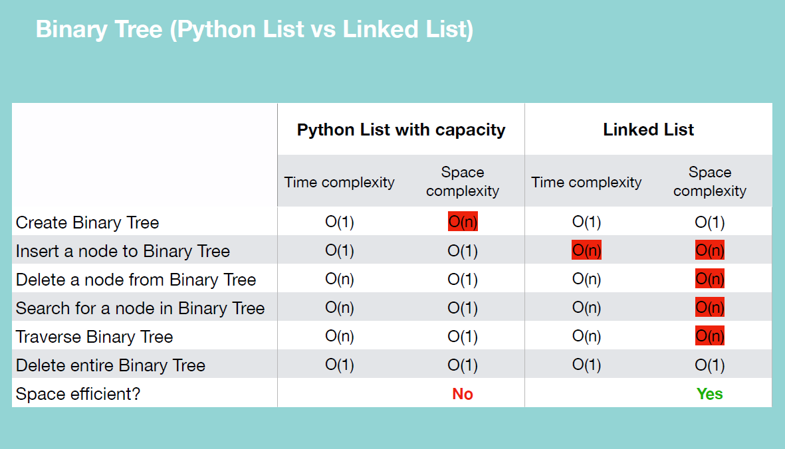


## Binary Search Tree (BST)

### What is a Binary Search Tree?
- A **Binary Search Tree (BST)** is a specialized type of **Binary Tree** with the following additional properties:
  1. **Left Subtree**: All nodes in the left subtree have values less than or equal to the parent node.
  2. **Right Subtree**: All nodes in the right subtree have values greater than the parent node.

#### Example:
```
         70
       /    \
     50      90
    /  \    /  \
   30   60 80  100
  /  \
 20  40
```

#### Why Do We Need a Binary Search Tree?
- BSTs provide faster operations like **search**, **insertion**, and **deletion** compared to unsorted linear data structures.
- Instead of sequentially traversing all elements, the BST's structure allows operations to reduce the search space by half at each step.

---

### Operations on Binary Search Tree (BST)

#### 1. **Insertion**
- A node is inserted based on the BST properties:
  - If the new value is less than or equal to the current node, it is placed in the left subtree.
  - Otherwise, it is placed in the right subtree.

##### Code:
```python
def insertNode(rootNode, nodeValue):
    if rootNode.data == None:
        rootNode.data = nodeValue
    elif nodeValue <= rootNode.data:
        if rootNode.leftChild is None:
            rootNode.leftChild = BSTNode(nodeValue)
        else:
            insertNode(rootNode.leftChild, nodeValue)
    else:
        if rootNode.rightChild is None:
            rootNode.rightChild = BSTNode(nodeValue)
        else:
            insertNode(rootNode.rightChild, nodeValue)
    return "The node has been successfully inserted"
```

---

#### 2. **Search**
- Searches the BST by recursively comparing the target value with the current node:
  - Move to the left subtree if the target is less than the current node.
  - Move to the right subtree if it is greater.

##### Code:
```python
def searchNode(rootNode, nodeValue):
    if rootNode.data == nodeValue:
        print("The value is found")
    elif nodeValue < rootNode.data:
        if rootNode.leftChild:
            searchNode(rootNode.leftChild, nodeValue)
        else:
            print("The value is not found")
    else:
        if rootNode.rightChild:
            searchNode(rootNode.rightChild, nodeValue)
        else:
            print("The value is not found")
```

---

#### 3. **Traversal**
- **Pre-order Traversal**: Visit root, left subtree, right subtree.
- **In-order Traversal**: Visit left subtree, root, right subtree.
- **Post-order Traversal**: Visit left subtree, right subtree, root.
- **Level-order Traversal**: Visit nodes level by level.

##### Code:
```python
def preOrderTraversal(rootNode):
    if not rootNode:
        return
    print(rootNode.data)
    preOrderTraversal(rootNode.leftChild)
    preOrderTraversal(rootNode.rightChild)

def inOrderTraversal(rootNode):
    if not rootNode:
        return
    inOrderTraversal(rootNode.leftChild)
    print(rootNode.data)
    inOrderTraversal(rootNode.rightChild)

def postOrderTraversal(rootNode):
    if not rootNode:
        return
    postOrderTraversal(rootNode.leftChild)
    postOrderTraversal(rootNode.rightChild)
    print(rootNode.data)

def levelOrderTraversal(rootNode):
    if not rootNode:
        return
    else:
        customQueue = queue.Queue()
        customQueue.enqueue(rootNode)
        while not(customQueue.isEmpty()):
            root = customQueue.dequeue()
            print(root.value.data)
            if root.value.leftChild is not None:
                customQueue.enqueue(root.value.leftChild)
            if root.value.rightChild is not None:
                customQueue.enqueue(root.value.rightChild)
```

---

#### 4. **Deletion**
- Deletes a node in the BST based on three cases:
  1. The node is a **leaf** (no children).
  2. The node has **one child**.
  3. The node has **two children**: Replace with the **in-order successor** (smallest value in the right subtree).

##### Code:
```python
def minValueNode(bstNode):
    current = bstNode
    while current.leftChild:
        current = current.leftChild
    return current

def deleteNode(rootNode, nodeValue):
    if rootNode is None:
        return rootNode
    if nodeValue < rootNode.data:
        rootNode.leftChild = deleteNode(rootNode.leftChild, nodeValue)
    elif nodeValue > rootNode.data:
        rootNode.rightChild = deleteNode(rootNode.rightChild, nodeValue)
    else:
        if rootNode.leftChild is None:
            temp = rootNode.rightChild
            rootNode = None
            return temp
        if rootNode.rightChild is None:
            temp = rootNode.leftChild
            rootNode = None
            return temp
        temp = minValueNode(rootNode.rightChild)
        rootNode.data = temp.data
        rootNode.rightChild = deleteNode(rootNode.rightChild, temp.data)
    return rootNode
```

---

#### 5. **Delete Entire BST**
- Deletes all nodes by setting the root node and its children to `None`.

##### Code:
```python
def deleteBST(rootNode):
    rootNode.data = None
    rootNode.leftChild = None
    rootNode.rightChild = None
    return "The BST has been successfully deleted"
```

---

### Time and Space Complexity of BST
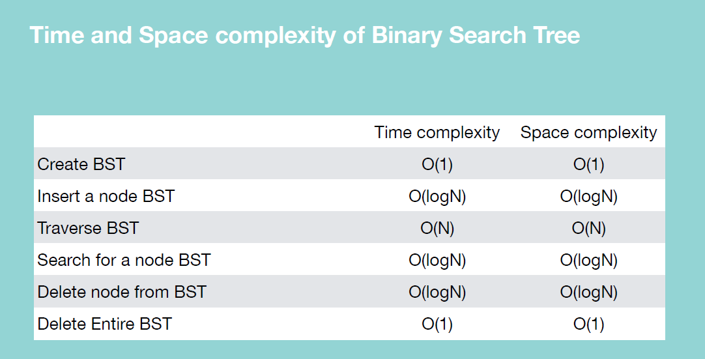

---

### Complete Example
```python
# Creating and operating on a BST
newBST = BSTNode(None)
insertNode(newBST, 70)
insertNode(newBST, 50)
insertNode(newBST, 90)
insertNode(newBST, 30)
insertNode(newBST, 60)
insertNode(newBST, 80)
insertNode(newBST, 100)
insertNode(newBST, 20)
insertNode(newBST, 40)

print("In-order Traversal:")
inOrderTraversal(newBST)

print("\nDeleting a node (50):")
deleteNode(newBST, 50)
inOrderTraversal(newBST)

print("\nDeleting entire BST:")
print(deleteBST(newBST))
```


Here is the consolidated Markdown file with theory and code for the **Graph** section:


## Graph Data Structure and Algorithms

### What is a Graph?
- A **Graph** is a nonlinear data structure consisting of:
  1. **Vertices** (or Nodes): Represented as circular objects.
  2. **Edges**: Represented as lines/arcs connecting the vertices.
  
#### Formal Definition:
A graph \( G \) consists of:
- \( V \): A finite set of vertices (nodes).
- \( E \): A set of edges connecting pairs of vertices.

#### Example:
```
    A ------ B
    |      / |
    |    /   |
    |  /     |
    C -------D
```

---

### Why Do We Need Graphs?
- **Real-life Applications**:
  - Represent networks (e.g., city paths, telephone circuits, or computer networks).
  - Used in social networks (e.g., LinkedIn, Facebook).
  - Shortest path problems in maps.
  
- **Tree vs Graph**:
  - A tree is a special type of graph that is **acyclic**.
  - Graphs allow cycles, enabling modeling of more complex relationships.

---

### Graph Terminology
1. **Vertices**: Nodes of the graph.
2. **Edges**: Connections between vertices.
3. **Unweighted Graph**: No weight assigned to edges.
4. **Weighted Graph**: Weight assigned to edges (e.g., cost, distance, time).
5. **Directed Graph**: Edges have a specific direction.
6. **Undirected Graph**: Edges have no direction.
7. **Cyclic Graph**: Contains at least one cycle.
8. **Acyclic Graph**: Contains no cycles.
9. **Tree**: A special case of a **Directed Acyclic Graph (DAG)**.

---

### Types of Graphs
1. **Unweighted and Undirected**: No weights; edges can be traversed in either direction.
2. **Unweighted and Directed**: No weights; edges have specific directions.
3. **Positive-Weighted and Undirected**: Positive weights with undirected edges.
4. **Positive-Weighted and Directed**: Positive weights with directed edges.
5. **Negative-Weighted and Undirected**: Includes negative weights with undirected edges.
6. **Negative-Weighted and Directed**: Includes negative weights with directed edges.

---

### Graph Representation

#### 1. **Adjacency Matrix**
- **Definition**: A 2D array where rows and columns represent vertices, and a cell value represents the presence (and possibly weight) of an edge.
- **Example** (Undirected Graph):
  ```
    A--B
    |  |
    C--D
  ```
  Adjacency Matrix:
  ```
    A B C D
  A  0 1 1 0
  B  1 0 0 1
  C  1 0 0 1
  D  0 1 1 0
  ```

- **Advantages**:
  - Easy to implement and understand.
  - Efficient for dense graphs.

- **Disadvantages**:
  - Memory inefficient for sparse graphs.

---

#### 2. **Adjacency List**
- **Definition**: A dictionary where:
  - Keys represent vertices.
  - Values represent a list of adjacent vertices.

- **Example**:
  ```
    A--B
    |  |
    C--D
  ```
  Adjacency List:
  ```python
  {
    'A': ['B', 'C'],
    'B': ['A', 'D'],
    'C': ['A', 'D'],
    'D': ['B', 'C']
  }
  ```

- **Advantages**:
  - Memory efficient for sparse graphs.
  - Easy to iterate through neighbors.

- **Disadvantages**:
  - Slightly slower for dense graphs compared to adjacency matrix.

---

### Implementing a Graph in Python

#### Graph Class
```python
class Graph:
    def __init__(self):
        self.adjacency_list = {}
    
    def add_vertex(self, vertex):
        if vertex not in self.adjacency_list.keys():
            self.adjacency_list[vertex] = []
            return True
        return False
    
    def print_graph(self):
        for vertex in self.adjacency_list:
            print(vertex, ":", self.adjacency_list[vertex])
    
    def add_edge(self, vertex1, vertex2):
        if vertex1 in self.adjacency_list.keys() and vertex2 in self.adjacency_list.keys():
            self.adjacency_list[vertex1].append(vertex2)
            self.adjacency_list[vertex2].append(vertex1)
            return True
        return False
    
    def remove_edge(self, vertex1, vertex2):
        if vertex1 in self.adjacency_list.keys() and vertex2 in self.adjacency_list.keys():
            try:
                self.adjacency_list[vertex1].remove(vertex2)
                self.adjacency_list[vertex2].remove(vertex1)
            except ValueError:
                pass
            return True
        return False
    
    def remove_vertex(self, vertex):
        if vertex in self.adjacency_list.keys():
            for other_vertex in self.adjacency_list[vertex]:
                self.adjacency_list[other_vertex].remove(vertex)
            del self.adjacency_list[vertex]
            return True
        return False
```

---

### Example Usage
```python
# Creating a graph
my_graph = Graph()
my_graph.add_vertex("A")
my_graph.add_vertex("B")
my_graph.add_vertex("C")
my_graph.add_vertex("D")

# Adding edges
my_graph.add_edge("A", "B")
my_graph.add_edge("A", "C")
my_graph.add_edge("A", "D")
my_graph.add_edge("B", "C")
my_graph.add_edge("C", "D")

# Printing the graph
my_graph.print_graph()

# Removing a vertex
my_graph.remove_vertex("A")
print("After remove...")
my_graph.print_graph()
```

---

### Choosing Representation
1. **Adjacency Matrix**:
   - Use for **dense graphs** (many edges).
   - Suitable for complete graphs.
2. **Adjacency List**:
   - Use for **sparse graphs** (few edges).
   - More memory-efficient.

---

### Key Points
- Graphs are versatile and widely used in real-life applications such as navigation systems, social networks, and network design.
- Choosing the right representation (Adjacency Matrix vs. Adjacency List) depends on the graph's density.
- Graph algorithms often build upon fundamental graph concepts, making understanding these basics essential.

---
## Graph Traversal: BFS and DFS

### What is Graph Traversal?
Graph traversal is the process of visiting every vertex in a graph. Traversal is used to explore the structure of the graph, examine relationships between nodes, and solve problems like finding the shortest path.

#### Example Graph
```
    A ---- B
    |      |
    C ---- D ---- E
```

Two primary graph traversal methods:
1. **Breadth-First Search (BFS)**
2. **Depth-First Search (DFS)**

---

### Breadth-First Search (BFS)

#### Definition:
BFS is an algorithm that starts at an arbitrary node (called the root) and explores all its neighbors at the current depth before moving to nodes at the next depth level.

#### How It Works:
- Start from the root node.
- Visit all neighboring nodes (level-by-level).
- Use a **queue** to track nodes to visit next.

#### Time Complexity:
- **O(V + E)** where \(V\) is the number of vertices and \(E\) is the number of edges.

#### Space Complexity:
- **O(V)** due to storing nodes in the visited set and the queue.

#### Use Case:
- When the target node is close to the starting point.

---

### Depth-First Search (DFS)

#### Definition:
DFS is an algorithm that starts at an arbitrary node (called the root) and explores as far as possible along each branch before backtracking.

#### How It Works:
- Start from the root node.
- Go as deep as possible along each path before backtracking.
- Use a **stack** to track nodes.

#### Time Complexity:
- **O(V + E)** where \(V\) is the number of vertices and \(E\) is the number of edges.

#### Space Complexity:
- **O(V)** due to storing nodes in the visited set and the stack.

#### Use Case:
- When the target node is buried deep in the graph.

---
### BFS vs DFS

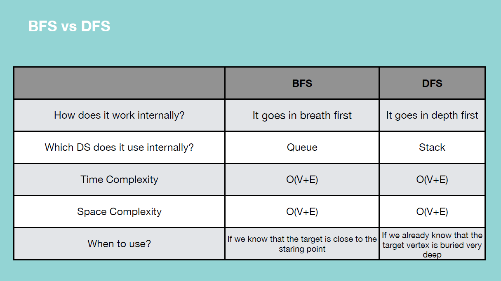

---

### BFS Implementation

#### Code
```python
from collections import deque

class Graph:
    def __init__(self):
        self.adjacency_list = {}
    
    def add_vertex(self, vertex):
        if vertex not in self.adjacency_list.keys():
            self.adjacency_list[vertex] = []
            return True
        return False
    
    def add_edge(self, vertex1, vertex2):
        if vertex1 in self.adjacency_list.keys() and vertex2 in self.adjacency_list.keys():
            self.adjacency_list[vertex1].append(vertex2)
            self.adjacency_list[vertex2].append(vertex1)
            return True
        return False
    
    def bfs(self, start_vertex):
        visited = set()
        queue = deque([start_vertex])
        visited.add(start_vertex)
        
        while queue:
            current = queue.popleft()
            print(current, end=" ")
            
            for neighbor in self.adjacency_list[current]:
                if neighbor not in visited:
                    visited.add(neighbor)
                    queue.append(neighbor)

# Example Usage
my_graph = Graph()
my_graph.add_vertex("A")
my_graph.add_vertex("B")
my_graph.add_vertex("C")
my_graph.add_vertex("D")
my_graph.add_vertex("E")
my_graph.add_edge("A", "B")
my_graph.add_edge("A", "C")
my_graph.add_edge("B", "E")
my_graph.add_edge("C", "D")
my_graph.add_edge("D", "E")

print("BFS Traversal:")
my_graph.bfs("A")
```

---

### DFS Implementation

#### Code
```python
class Graph:
    # Other methods...

    def dfs(self, start_vertex):
        visited = set()
        stack = [start_vertex]
        
        while stack:
            current = stack.pop()
            if current not in visited:
                print(current, end=" ")
                visited.add(current)
                
                for neighbor in self.adjacency_list[current]:
                    if neighbor not in visited:
                        stack.append(neighbor)

# Example Usage
my_graph = Graph()
my_graph.add_vertex("A")
my_graph.add_vertex("B")
my_graph.add_vertex("C")
my_graph.add_vertex("D")
my_graph.add_vertex("E")
my_graph.add_edge("A", "B")
my_graph.add_edge("A", "C")
my_graph.add_edge("B", "E")
my_graph.add_edge("C", "D")
my_graph.add_edge("D", "E")

print("DFS Traversal:")
my_graph.dfs("A")
```

---

## BFS and DFS Comparison Example
- **Graph**:
  ```
      A ---- B
      |      |
      C ---- D ---- E
  ```
- **BFS Output**: `A B C D E`
- **DFS Output**: `A C D E B`

---

### Key Insights
- **BFS** uses **queue** for level-by-level exploration.
- **DFS** uses **stack** for depth-first exploration.
- Both algorithms have the same time complexity, but their applications differ based on the problem domain.

## SORTING
It refers to arranging data in a given order

### Types of sorting algorithms:

-   Bubble Sort
-   Selection Sort
-   Insertion Sort
-   Bucket Sort
-   Merge Sort
-   Quick Sort
-   Heap Sort


**How to classify the sorting operations**

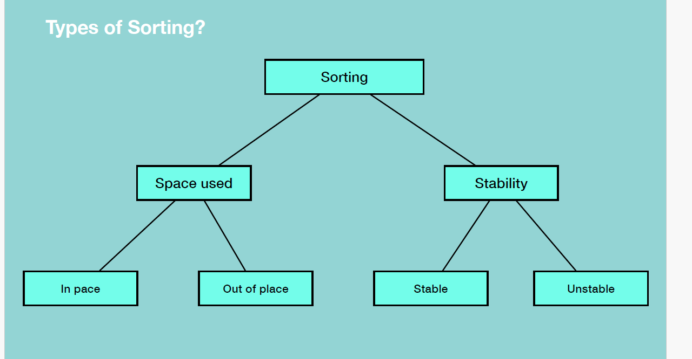

-   **In-Place**: Doesn't require extra space for sorting. Eg. Bubble Sort
-   **Out-Place**: Sorting requires extra space. Eg. Merge Sort

-   **Stable**: If a sorting algorithm after sorting the contents does not change the sequence of similar content in which they appear, then this sorting is called stable sorting. For eg. Insertion sort

-   **Unstable**: If a sorting algo after sorting the contents changes the sequence of similar content in which they appear, then it is called unstable sort. For eg. Quick Sort
### Sorting Terminology

-   **Increasing Order**
-   **Decreasing Order**
-   **Non-Increasing Order** (If successive element is less than or equal to its previous element in the sequence. It is seen when we have duplicate values)
-   **Non-decreasing order** (If successive element is greater than or equal to its previous element in a sequence. It is seen when we have duplicate values)

### Which algorithm to select?
-   Stability
-   Space Efficient
-   Time Efficient

#### Bubble Sort
1.  Also called Sinking Sort
2.  We repeately compare each pair of adjacent item and swap if they are in the wrong order
3.  In one pass the last element is the greatest and **that last element is considered as fully sorted**.
4.  You do another pass and compare adjacent elements and make the swap if required. This will make the second last element as the **second highest** and you can call the last 2 elements are **fully sorted**
5.  You keep doing these passes until the entire array is fully sorted.

**TC and SC For Bubble Sort**: O(n^2), O(1)

6.  Bubble sort is used where
    -   Space is of concern
    -   When input is already sorted
    -   Easy to implement
7.  When we need to avoid:
    -   Average time complexity of Bubble sort is very poor

#### Selection Sort
1.  This involves finding the minimum element and move it to the sorted part of the array to make unsorted part sorted
2.  It perfrom well on short array
3.  There is no space required while doing this sort
4.  It requires **O(N^2)** time complexity
5.  This algo for sorting scales very bad with large arrays
6.  You use Selection Sort where you have insufficient memory
7.  Where time is a concern you should avoid Selection Sort since it has quadratic time complexity


#### Insertion Sort
1.  Divide the array into two parts
2.  Take first element form unsorted array and find its correct position in sorted array
3.  The only difference that Insertion sort has from Selection sort is that in selection sort we take the **min element** from unsorted array into the sorted array position. Whereas in the insertion sort we take **any element** from the unsorted portion and place that into it's right position in the sorted poriton of your array.
4.  Repeat until unsorted array is empty
5.  **Time Complexity : O(N^2)**
6.  **Space Complexity: O(1)** (since the sorting is in-place)
7.  Main advantage of Insertion method is it's **space efficiency**
8.  Since it's time complexity is very high, so it should not be used in case of very large arrays.


#### Bucket Sort
1.  Create buckets and insert array elements into those buckets
2.  Sort the buckets individually
3.  Merge buckets after sorting
4.  Number of buckets are calculated like this:
    `Number of buckets=round(Sqrt(number of elements))`
5.  To find which element goes in which bucket:
    `Appropriate bucket=ceil(value * number of buckets / maxValue)`
6.  We can use any sorting algorithm to sort the buckets individually
7.  During mergin you just have to bring the contents of buckets and append them after one another
8.  A bucket sort implemented using **Insertion Sort** will have **O(N^2)** time complexity
9.  Usually we implement Bucket Sort using **Quick Sort** and in that case it has a time complexity of **O(NlogN)**
10. **Important**: We use Bucket sort when input is uniformly distributed over range. If there are any outliers then that can result in skew during distribution of data in buckets
11. **Important**: We avoid bucket sort in situation where there is a space concern
12. **The time complexity of bucket sort varies depending on the distribution of the input data and the sorting algorithm used for sorting each bucket.**
13.  Incase there are **negative numbers** in the array that you want to sort then the only change is in the **Bucket allocation formula**

#### Merge Sort
1.  Merge sort is a divide and conquer algorithm
2.  In this we divide the array into two halves and we keep halving recursively until they become too small that can't be broken further
3.  Merge halves by sorting them 
4.  Here we create two functions: `merge_sort(custom_list)`    and     `merge(element1,element2,parent_list)`
5.  In `merge_sort` we use **Recursion**
6.  The **Time Complexity** of merge sort is **O(NlogN)** and **Space Complexity** is **O(N)** since we need to create sub-arrays.
7.  It is **better** in terms of performance from other sorting algorithms we have discussed so far.
8.  Merge sort is good in cases:
    -   When you need to do a stable sort
    -   When average expected time is O(NlogN)
    -   It should be avoided when space is a concern

#### Quick Sort


 ## SEARCHING

 ## Main types of searching algorithms:
 -  **Linear Search**
 -  **Binary Search**

 ### Linear Search
 1. Also called as `sequential search`. It can be applied to **sorted as well as unsorted** array
 2. Traverse linearly in your array and search for the target element
 3. Stop where you find your target element and return `True` as the result
 4. **Time complexity** is **O(N)**
 5. **Space complexity** is **O(1)** since we are using something extra space


#### Pseudo Code for Linear Search


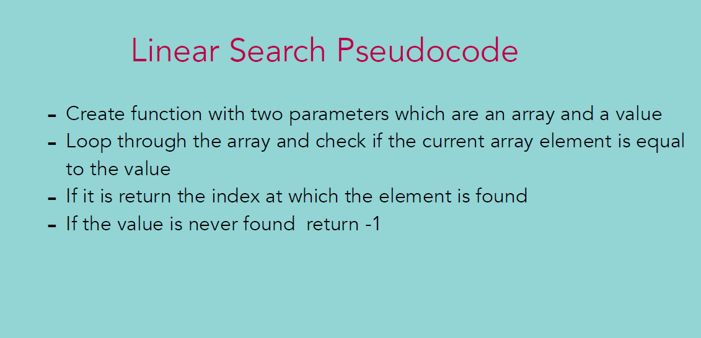


### Binary Search
1.  Binary Search is much faster than Linear Search
2.  Half of the remaining elements can be eliminated at a time, instead of eliminating them one by one
3.  Binary Search works only on **sorted array**
4.  **Time Complexity** is O(logN) and **Space Complexity** is O(1)


#### Pseudo Code for Binary Search


### Binary Search (with Recursion)

```python
    def binary_search(arr, left, right, target):
        if left > right:
            return -1
        mid = (left + right) // 2
        if arr[mid] == target:
            return mid
        elif arr[mid] < target:
            return binary_search(arr, mid + 1, right, target)
        else:
            return binary_search(arr, left, mid - 1, target)
```

-   **TC** for BS with Recursion is **O(logN)**
-   **SC** for BS with Recursion is **O(logN)**


